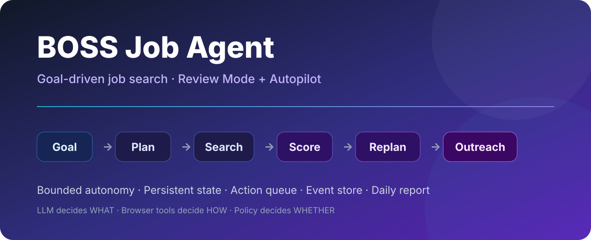
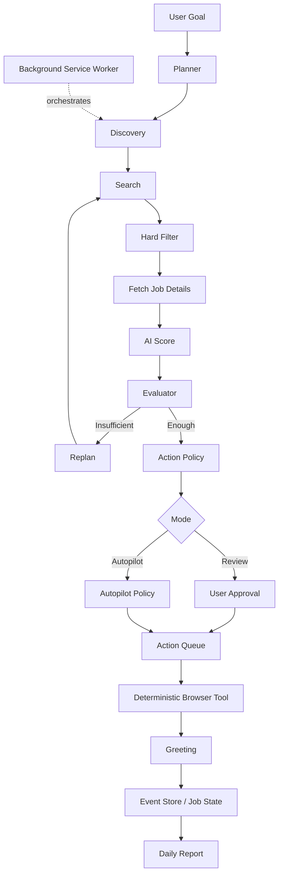

# BOSS Job Agent



<p align="center">
  <strong>Goal-driven AI Job Agent for BOSS Zhipin</strong><br/>
  Plans, searches, scores, replans and contacts matching recruiters inside your own Chrome session.
</p>

<p align="center">
  
  
  
  
  
</p>

**一句话描述你的求职目标，Agent 会自己规划搜索、读取岗位、AI 打分、评估结果、必要时调整搜索策略，并在你设定的边界内执行联系；每天 18:00 生成一份求职执行日报。**

> ⭐ 如果这个项目帮你减少了重复刷岗位、筛 JD 和机械打招呼的时间，欢迎点一个 **Star**。这会让更多求职者和 Agent 开发者发现它。

[快速开始](#-快速开始) · [两种模式](#-两种运行模式) · [真实案例](#-一次真实的-agent-决策) · [架构](#️-architecture) · [Roadmap](ROADMAP.md) · [Changelog](CHANGELOG.md) · [贡献](CONTRIBUTING.md)

> [!IMPORTANT]
> **v0.5.0** ｜个人开源 / 作品集项目，非 BOSS 直聘官方工具、与 BOSS 直聘无关。自动化操作可能受到平台规则或风控限制，请自行判断并承担使用风险。
>
> 本项目不包含也不接受：验证码绕过、反检测 / 指纹伪装、代理池、多账号或无限量自动化。

---

## 🚀 30 秒看懂

```text
“上海 AI 产品经理，优先 Agent / LLM / 大模型应用，
30K 以上，不要外包、纯售前和纯运营。”

                    ↓

Goal → Plan → Search → Filter → JD → AI Score
                          ↓
                      Evaluate
                     ↙        ↘
                  Replan     Enough
                     ↘        ↙
                       Policy
                    ↙          ↘
              Review Mode   Autopilot
                    ↓          ↓
                 Greeting → Event Store → Daily Report
```

它不是“固定关键词 + 固定脚本”的批量投递器。Agent 会根据真实搜索结果决定：**继续搜、调整搜索词、执行联系，还是停止。**

### 为什么这个项目值得关注

| | 不是 Demo Wrapper，而是实际执行链 |
|---|---|
| 🧠 **Goal-driven** | 自然语言目标 → Planner → 多搜索方向，不要求用户手写固定工作流 |
| 🔁 **Adaptive Replan** | 当前候选不足时才扩展搜索，且不能修改城市 / 硬约束 / 薪资底线 |
| 🛡️ **Bounded Autonomy** | 分数阈值、每日上限、工作时间、最大轮次、风险暂停共同限制 Autopilot |
| 🧾 **Auditable** | Action Queue + Event Store + Job State，能回答“准备做什么 / 做过什么 / 结果是什么” |
| ♻️ **Recoverable** | MV3 Service Worker 被回收、Side Panel 关闭后，运行状态仍可从 storage 恢复 |
| 📊 **Daily Report** | 日报来自结构化事件聚合，不靠 LLM 编故事 |

核心设计原则：

> **LLM decides WHAT. Deterministic browser code decides HOW. Policy decides WHETHER.**

---

## 🎛️ 两种运行模式

| 模式 | 谁决定“发不发” | 适合谁 |
|---|---|---|
| **Review Mode**（默认） | **你**：Agent 搜索、打分、推荐；你勾选并确认后才打招呼 | 第一次使用 / 想逐条把关 |
| **Autopilot** | **Policy**：在阈值、每日上限、工作时间和授权范围内自动执行 | 想让 Agent 按纪律自己跑 |

### Review Mode

```text
Goal
→ Search / Score / Replan
→ Shortlist
→ User Approval
→ Greeting
```

### Autopilot Mode

```text
Goal
→ Search / Score / Replan
→ Autopilot Policy
→ Action Queue
→ Auto Greeting
→ Daily Cap / Stop Condition
→ Daily Report
```

Autopilot 需要首次显式授权；切回 Review 会撤销授权。用户始终能看到并修改真实发送的话术，并可随时 **Pause / Resume / Stop**。

---

## 🎯 一次真实的 Agent 决策

例如：

```text
Goal: 上海 AI 产品经理，偏 Agent / LLM / 大模型应用
Auto-contact threshold: 85
Daily cap: 2
```

运行过程可能是：

```text
Round 1
├─ 搜索 5 个方向
├─ Hard Filter
├─ AI Score
├─ Recommended: 12          # AI 认为值得关注（≥75）
└─ Autopilot Eligible: 0    # 真正达到自动联系规则的候选
        ↓
      Replan

Round 2
├─ 新增 大模型应用 / 智能体 / AIGC 等搜索方向
├─ AI Score
└─ Autopilot Eligible: 5
        ↓
      Policy
        ↓
   Contact top candidate
        ↓
 Daily cap reached
```

### `Recommended` ≠ `Autopilot Eligible`

- **Recommended**：AI 认为岗位值得关注，目前推荐线为 `score >= 75`。
- **Autopilot Eligible**：还要同时满足用户设置的自动联系分数、硬约束、去重、岗位完整性、话术有效性和 Policy。

这个区分的目的很简单：**“AI 觉得不错”不等于“Agent 有权替你发消息”。**

---

## ⚡ 快速开始

### 1. 环境

- Google Chrome
- **Node.js >= 22.13.0**
- DeepSeek API Key

### 2. 启动本机 AI 服务

```bash
git clone https://github.com/CceliaXXx818/boss-job-agent.git
cd boss-job-agent
npm ci

echo 'DEEPSEEK_API_KEY=你的key' > .env
npm run score:serve
```

默认只监听：

```text
http://127.0.0.1:8799
```

### 3. 配置 Candidate Profile

```bash
cp config/candidate.example.json config/candidate.json
```

编辑 `config/candidate.json`，填写你的工作年限、技能、项目经历、目标方向和排除项。

### 4. 安装 Chrome Extension

1. 打开 `chrome://extensions`
2. 开启「开发者模式」
3. 点击「加载已解压的扩展程序」
4. 选择仓库里的 `extension/`
5. 打开 BOSS 直聘并**手动登录**
6. 点击扩展 → 打开 Job Agent Side Panel

### 5. 第一次跑 Autopilot

建议先用保守设置：

```text
Minimum Auto Greeting Score: 85+
Daily Greeting Cap: 1
Max Discovery Rounds: 1–2
```

先确认一轮真实运行、Action / Event 记录和实际话术都符合预期，再主动提高上限。

---

## 🔄 它一天在做什么

```text
Goal（自然语言）
   ↓  /plan（LLM，只输出结构化计划）
搜索计划（城市来自当前 BOSS 页面；查询 ≤ 6）
   ↓
Search → Hard Filter → Fetch Detail
   ↓
/score → Recommended → Autopilot Eligible
   ↓
候选不足？── Yes → /replan 补充搜索词（最多一次 / 轮）
   │ No
   ↓
Policy（阈值 / Daily Cap / 工作时间 / 风险 / 幂等）
   ↓
Action Queue: pending → approved → executing
   ↓
Greeting（确定性 DOM 代码）
   ↓
GREETING_SENT / GREETING_FAILED
   ↓
Round End → 下一轮 / 收工
   ↓
18:00 Daily Report（Event Store 聚合，不依赖 LLM）
```

- **不会长驻无限循环**：Background Service Worker 通过 bounded step + `chrome.alarms` 推进，每步立即落盘。
- **不会重复发送**：创建、执行前、事件写入、中断恢复多层去重；不确定是否发出的中断 Action 会进入 `requires_manual`，不会盲目重发。
- **不会为了凑额度突破风险页**：验证码、登录失效、风险页、连续工具失败等情况会暂停并交还用户。

---

## 📊 Daily Report

每天 18:00（`dailyReportTime` 可配置）生成正式快照；如果 Chrome 当时没打开，会在下次合适的唤醒点补生成，同一天只有一份正式日报。

核心指标全部来自 **Event Store / Job State / Runtime**：

- 今日发现 / AI 分析 / AI 推荐 / 已联系 / 联系失败
- Discovery Rounds、实际执行搜索词、Replan 次数
- 每轮表现与停止原因
- Top Candidates
- 今日未联系的高质量候选
- 已联系岗位明细
- 失败 / 暂停 / 风险事件
- Review vs Autopilot 来源拆分（数据可靠时）

当前还没有 HR Message Monitor，因此日报**不会伪造** `HR Replies = 0`、`Resume Requests = 0` 或 `Interview = 0`。这些字段会等真正拥有监测能力后再加入。

---

## 🏗️ Architecture



| 层 | 位置 | 职责 |
|---|---|---|
| **Eyes + Hands** | `extension/content.js` | 搜索、列表、详情、Greeting、页面健康信号 |
| **Orchestrator** | `extension/background.js` | Autopilot 编排、alarms、执行标签、风险处理、日报调度 |
| **Step Machine** | `extension/autopilot-engine.js` | bounded steps：PLAN → SEARCH → FILTER → DETAIL → SCORE → EVALUATE → REPLAN → OUTREACH → ROUND_END… |
| **Shared Core** | `extension/discovery-runner.js`、`ai-client.js` | Review / Autopilot 共用过滤、评估、Replan、AI 调用 |
| **Persistence** | `event-store.js`、`job-state.js`、`action-queue.js`、`autopilot-runtime.js` | 事件、岗位状态、动作队列、运行时恢复 |
| **Policy** | `core-logic.js`、`autopilot-policy.js`、`settings.js` | 硬约束、限额、工作时间、风险、幂等 |
| **Brain** | `packages/model-client` | `/plan` `/replan` `/score`，只产出结构化数据，不直接操作 DOM |

想深入看设计：[`docs/AGENT-ARCHITECTURE.md`](docs/AGENT-ARCHITECTURE.md) · [`docs/DESIGN-v0.5.md`](docs/DESIGN-v0.5.md) · [`docs/PRD-v0.5.md`](docs/PRD-v0.5.md)

---

## 🛡️ Safety & Guardrails

- **Review Mode 长期保留**：不是“Autopilot 或不用”的二选一
- **显式 Consent**：首次开启 Autopilot 必须授权
- **Hard Constraints > AI Score**：明确不要的岗位不会因为高分被放行
- **Daily Cap**：限制当天真实外部动作数量
- **Working Hours**：不为凑额度夜间继续联系
- **Bounded Discovery / Replan**：存在最大轮次和 Replan 上限
- **Greeting 可见**：固定话术由用户查看和编辑
- **Persistent Queue + Idempotency**：页面刷新、SW 重启等情况下防止重复发送
- **Fail Closed**：验证码、登录异常、风险页、连续工具失败 → Pause

明确不做：

- CAPTCHA bypass
- anti-detection / fingerprint spoofing
- proxy-pool evasion
- unlimited mass outreach
- 自动回答开放式 HR 问题

---

## 🧪 Testing

```bash
npm run typecheck
npm test
npm run ci
npm run scan:redline
```

当前：**48 个测试文件 / 525 个用例**。

覆盖 Planner / Replan 边界、Policy、Action Queue 状态机与幂等、Runtime 恢复与 SW 中断、Replan 终止、评分分批与续评、工作时间窗口、日报聚合与 snapshot 幂等等。

---

## 🔐 Permissions

坚持逐阶段最小权限：

| 权限 | 用途 |
|---|---|
| `storage` | Events / Job State / Action Queue / Runtime / Daily Report |
| `tabs` | 维护 Autopilot inactive execution tab |
| `sidePanel` | 主 UI |
| `alarms` | Autopilot tick + Daily Report |
| `downloads` | 导出日报 Markdown |
| `*.zhipin.com` / localhost | BOSS 页面 + 本机 AI 服务 |

当前**没有**：`notifications`、`unlimitedStorage`、`scripting`、`webRequest`、`cookies`、`history`。

---

## 🗺️ Roadmap

### ✅ v0.5 — Job Autopilot

- Goal-driven Planning
- Adaptive Replan
- Review + Autopilot dual mode
- Explicit Consent + Policy
- Background execution
- Action Queue / Event Store / Job State
- Daily Cap / Working Hours / Risk Pause
- Greeting Strategy
- Daily Report

### 🔜 v0.6 — Conversation Loop

- Read-only HR Message Monitor
- Message deduplication
- Conversation → Job mapping
- Intent Classification
- Human notification
- Resume-request workflow（高风险动作继续使用更严格 gate）

### 💡 Later

- JD-personalized Greeting
- Candidate Pool / cross-day reuse
- Preference Memory
- Outcome-driven search optimization
- More job platforms

完整路线见 [`ROADMAP.md`](ROADMAP.md)。

---

## 📚 文档地图

| 文档 | 内容 |
|---|---|
| [`docs/AGENT-ARCHITECTURE.md`](docs/AGENT-ARCHITECTURE.md) | Agent 架构模式、为什么这么选、7 步学习路线 |
| [`docs/PRD-v0.5.md`](docs/PRD-v0.5.md) | 当前 V0.5 完整产品需求与验收标准 |
| [`docs/DESIGN-v0.5.md`](docs/DESIGN-v0.5.md) | 当前实现设计、状态机、事件、幂等、调度、测试 |
| [`docs/INDEX.md`](docs/INDEX.md) | 文档阅读顺序与代码入口 |
| [`docs/PM-INTERVIEW-STORY.md`](docs/PM-INTERVIEW-STORY.md) | 面向产品经理面试的项目讲法（故事脚本、决策依据、指标口径、问答防御） |
| [`CHANGELOG.md`](CHANGELOG.md) | 版本变化与真实事故修复 |
| [`ROADMAP.md`](ROADMAP.md) | 下一步路线 |
| [`CONTRIBUTING.md`](CONTRIBUTING.md) | 如何贡献 |

> `docs/PRD.md` / `ARCHITECTURE.md` / `DATA_MODEL.md` / `TOOL_SPEC.md` / `IMPLEMENTATION_PLAN.md` 是早期 V0.1 设计路线；当前实现请优先阅读上表文档。

---

## 🤝 Contributing

欢迎：Bug fix、测试、Agent Eval、Planner / Replan 优化、Policy / Guardrail 改进、页面兼容、UI/UX 和文档贡献。

开始前请阅读 [`CONTRIBUTING.md`](CONTRIBUTING.md)。特别欢迎能够附带**可复现日志 + 测试**的 PR。

---

## ⭐ Star

如果你正在做 AI Agent、浏览器 Agent、求职自动化，或者这个项目真的帮你节省了重复操作：

**欢迎点 Star。**

它会告诉我这个方向值得继续投入，也会让更多需要它的人更容易找到这个项目。

---

## ⚠️ 已知边界

- Autopilot **只在 Chrome 打开时**推进；严格 18:00 不保证，通过 catch-up 补生成日报
- MONITORING 当前只是“主动 Outreach 结束”的终点状态，**还没有 HR 回复监测**
- 未联系的高质量候选目前不会跨天自动消费
- Email 日报、HR Monitor、Resume 相关能力尚未实现
- 搜索词由模型生成；同一个 Goal 在 `temperature: 0` 下通常会产生接近的搜索策略

---

## Disclaimer & License

- 仅供个人学习、研究与求职辅助。
- 请遵守 BOSS 直聘服务条款及你所在地法律法规。
- 自动化操作可能导致账号受限，使用者需自行承担风险。
- 本项目不是 BOSS 直聘官方产品，也不代表 BOSS 直聘。
- Apache-2.0，详见 [`LICENSE`](LICENSE)。
