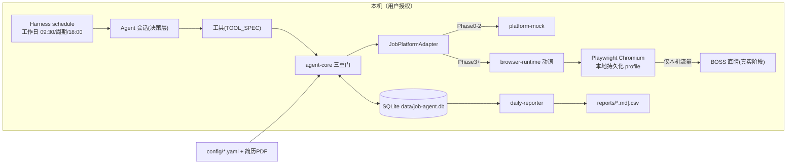

# 自动求职投递 Agent — 总体架构设计（ARCHITECTURE.md）

> 状态：规划稿 v0.1，等待确认，尚未实现任何业务代码
> 输入文档：docs/PRD.md、docs/USER_PROFILE.md
> 关联文档：docs/DATA_MODEL.md、docs/TOOL_SPEC.md、docs/IMPLEMENTATION_PLAN.md
> 目标引擎：DeepSeek Harness（当前本机运行时为 npm `@deepseek-ai/dsh@0.1.1-rc.2`；**正式版本/commit 在 IMPLEMENTATION_PLAN.md P0 阶段锁定**，本文件所有 API 名称在 Phase 0 对照锁定代码核验，设计只约定职责与调用语义）

---

## 0. 术语与决策编号约定

| 记号 | 含义 |
|---|---|
| `D-nn` | 本文档作出、但有前提条件的默认设计决策（默认值已给出，用户可推翻） |
| `Q-nn` | **仍需用户拍板的问题**，正文引用 Q 编号，完整清单见 IMPLEMENTATION_PLAN.md 附录 A |
| Agent / 模型 | DeepSeek Harness 驱动的 LLM 决策回路，只负责"决策" |
| 浏览器执行层 | 确定性代码（Playwright + 页面对象），只负责"执行" |

---

## 1. 产品目标、P0 范围与明确不做的事

### 1.1 产品一句话定义

> 一个**本地运行、定时执行、可审计**的自动求职投递 Agent：工作日自动搜索岗位、匹配排序、主动打招呼、识别 HR 回复并发送简历，18:00 输出投递日报。

开源定位（继承 PRD 第十一/十二节结论）：

> 本地运行、用户自己授权、有限额、全程可暂停的个人求职助手。

### 1.2 P0 范围（第一版交付）

| 能力域 | P0 内容 |
|---|---|
| 平台 | **仅 BOSS 直聘**；但所有业务代码依赖 `JobPlatformAdapter` 抽象，首个可用实现是 `MockPlatformAdapter` |
| 运行形态 | 本地运行；工作日（周一至周五）定时驱动 Agent 会话 |
| 求职配置 | 城市 / 岗位关键词 / 排除条件 / 薪资 / 经验 / 每日上下限 / 时间窗（读取 `config/*.yaml` 与 USER_PROFILE 画像） |
| 简历解析 | 本地 PDF 简历 → 结构化候选人画像（Profile Evidence） |
| 岗位发现 | 按配置搜索 → 读列表 → 读详情 → **确定性去重** |
| 岗位匹配 | 硬条件过滤（程序）＋ 逐条证据评分（模型出证据、程序出分） |
| 自动打招呼 | 已审核模板 + 受限字段替换，**不允许模型自由发挥** |
| 消息监听 | 时间窗内定时拉取未读 HR 消息 → 意图识别 |
| 简历发送 | 仅当 HR 意图命中"明确索要简历/要求投递"白名单时自动发送（在线或附件） |
| 预设应答 | 对"在职？多久到岗？接受某城？在吗"等走固定预设答案 |
| 人工接管 | 复杂/敏感话题一律转入 `needs_human` 队列并停止该会话动作 |
| 进度管理 | 每岗位状态机（发现→沟通→投递→回复→…），见 DATA_MODEL.md |
| 异常控制 | 登录失效 / 验证码 / 页面结构变化 → 全局 `pause`，绝不盲目点击 |
| 操作日志 | 每次判断与每次外部操作全量落库（append-only） |
| 日报 | 工作日 18:00 生成 Markdown + CSV，含汇总/明细/需人工处理/异常 |
| 可测试性 | 全链路可在 Mock 平台上确定性回放；模型调用可 mock、时钟可虚拟 |

### 1.3 明确不做的功能（Not In Scope，写死边界）

1. **不提供**验证码绕过、反检测、指纹伪装、代理池、批量账号、分布式抢投。
2. **不自动**承诺面试时间、薪资、工作地点；不替用户谈判。
3. **不实现** LinkedIn / 猎聘等多平台（P0 只有 BOSS，且首个实现是 Mock）。
4. **不接入**任何未经验证的 BOSS 私有/非官方 API；不爬取登录后之外的页面。
5. **不把**简历原件、Cookie、账号密码、API Key、HR 真实聊天内容提交到 Git（`.gitignore` + 目录约束见 §6.6）。
6. **不做**真实平台"先上车后补票"：真实 BOSS 阶段必须以用户人工完成登录、协议复核、显式开启（Q12）为前提，见 IMPLEMENTATION_PLAN.md。
7. P0 不实现 Web 通知推送/邮件/IM 提醒（可后续插件化）；暂停与人工队列以本地界面/文件呈现（Q13）。
8. P0 不实现 Docker 化运行（Q8），只保证本地一键运行（npm workspaces，见 P0 决策记录）。

### 1.4 非功能目标（Acceptance 挂钩）

- 一切**外部写操作**：可审计、可暂停、幂等不可重复执行（§4.4）。
- 决策层与执行层分离：模型永远拿不到"裸 DOM/裸 Playwright 指令"。
- 全流程离线可测：不登录 BOSS 也能跑通并验收 P0 业务（Mock）。
- 数据隐私：Cookie 与简历原件不出本机，见 §6.6。
- 版本锁定：Harness 与全部关键依赖锁定，升级需显式操作。

---

## 2. 架构原则（驱动所有模块边界）

| # | 原则 | 落地方式 |
|---|---|---|
| A1 | **模型决策、代码执行** | Agent 只能调用注册工具；工具内部是确定性 TS 代码。浏览器动作封装成页面对象动词，模型不可直接操作网页（PRD 第九节） |
| A2 | **写操作三重门** | 任何对外写工具必经：`Policy 裁决 → 限额/幂等检查 → 审计落库`，先登记后执行（action_intents 表），见 §4.4 |
| A3 | **证据优先、程序算分** | 硬过滤与权重计算由确定性代码完成；模型只负责读 JD、提取"需求↔简历证据"并输出结构化证据（PRD 第四节） |
| A4 | **模板受限生成** | 打招呼/预设应答只用经用户确认的模板，替换字段白名单化，禁止生成简历中不存在的能力（PRD 第五节） |
| A5 | **状态机唯一事实源** | SQLite 是投递进度、消息、日志的唯一持久事实源；日报/报告都是它的派生物 |
| A6 | **失败即收敛** | 网络失败有限重试；验证码/登录失效/页面异常 → `pause`，等用户处理，不自动恢复重试 |
| A7 | **适配器隔离** | 业务核心只认 `JobPlatformAdapter` 接口；真实平台差异全部封在 adapter 内部 |
| A8 | **本地优先、最小权限** | 浏览器持久化 profile 仅本机；凭据不进进程参数、不进日志、不进 Git |
| A9 | **可回放** | 时钟抽象 + Mock 平台 + 种子数据 ⇒ 同一输入序列产出同一审计轨迹（测试与演示） |
| A10 | **版本锁定** | 所有运行时依赖精确锁版，Harness 锁版本/commit（Q1） |

---

## 3. 整体技术架构

### 3.1 技术栈（继承 PRD 第十节并细化）

| 层 | 选型 | 说明 |
|---|---|---|
| Agent 运行时 | DeepSeek Harness（锁定版本，Q1） | 工具注册、Agent 决策回路、定时唤醒、会话状态 |
| 语言 | TypeScript（strict）+ npm workspace | 全仓 TS，Node ≥ 20 |
| 浏览器 | Playwright（本地持久化 Chromium profile） | 首次用户手动扫码登录，之后复用本机会话 |
| 存储 | SQLite（`better-sqlite3` 或 `node:sqlite`，Phase 0 定） | 单文件 `data/job-agent.db` |
| Schema 校验 | Zod | 工具入参/出参、配置、外部数据全部经 Zod |
| 意图/评分 | 规则引擎（确定性优先） + DeepSeek 模型（仅当规则不足以判定的证据提取） | HR 意图"明确索要简历"等规则即可高置信判定的，不调模型（省成本、可测试） |
| 定时 | Harness schedule/cron 插件（锁版本后核验 API） | 09:30 开工、时间窗内周期查消息、18:00 日报 |
| PDF | pdf-parse（TS 优先）或 PyMuPDF（Q16） | 简历→Profile Evidence 一次性离线转换 |
| 测试 | Vitest + Playwright test fixtures + Mock 平台 | 见 IMPLEMENTATION_PLAN.md §测试策略 |
| 配置 | YAML + Zod（`config/*.example.yaml`） | 见 §6.4 |

### 3.2 系统分层与模块边界

```
┌────────────────────────────────────────────────────────────────┐
│  调度/宿主层  dsh(DeepSeek Harness)：cordis 组合 + schedule + agent preset │
│  · 注册工具清单(TOOL_SPEC)  · 定时唤醒 · 会话生命周期             │
├────────────────────────────────────────────────────────────────┤
│  决策层  dsh-integration（Harness 桥）                            │
│  · 把 agent-core 领域操作暴露为工具 · 工具治理(读/写/暂停/审计)     │
├────────────────────────────────────────────────────────────────┤
│  业务核心(平台无关)                                               │
│  agent-core        会话编排/限额/状态机/暂停恢复/每日计划/日报调度    │
│  job-matcher       硬过滤 + 证据评分(程序算分)                    │
│  conversation-policy 问候模板管理 + HR 意图裁决(规则+模型) + 应答策略 │
│  daily-reporter    MD/CSV 日报渲染                                │
├────────────────────────────────────────────────────────────────┤
│  端口层(interface 定义，见 §5)                                    │
│  JobPlatformAdapter · ResumeSender · Clock · IdempotencyStore   │
├────────────────────────────────────────────────────────────────┤
│  适配器(同一接口多实现)                                           │
│  platform-mock     MockPlatformAdapter（P0~P2 唯一启用实现）       │
│  platform-boss     BossPlatformAdapter（Phase 3+ 可选，需用户授权） │
│  browser-runtime   确定性 Playwright 动词库 + 页面对象 + 护栏      │
├────────────────────────────────────────────────────────────────┤
│  基础设施  sqlite-store · audit  · config-loader · vault(本机密钥) │
└────────────────────────────────────────────────────────────────┘
```

模块职责边界（谁不许碰谁）：

| 模块 | 允许依赖 | 明确禁止 |
|---|---|---|
| agent-core | 所有端口接口、sqlite-store | 直接 import platform-boss、browser-runtime、模型调用细节 |
| job-matcher | 画像/JD 类型、模型"证据提取"客户端（只允许结构化输出） | 调用适配器、产生外部副作用 |
| conversation-policy | 消息类型、模板配置 | 自行发消息；发消息一律交 agent-core 走三重门 |
| browser-runtime | Playwright | 做业务决策；只暴露受限动词 |
| platform-boss / platform-mock | JobPlatformAdapter + browser-runtime（boss 用） | 内含业务规则 |
| dsh-integration | 全部业务模块 | 把决策逻辑写进工具壳 |

### 3.3 包结构（调整自 PRD 第十一节，新增两个包）

```text
job-application-agent/
├── package.json / package-lock.json / tsconfig.base.json
├── cordis/                       # Harness 组合片段（host 行 + agent preset 文件）
├── config/
│   ├── profile.example.yaml      # ← 与 docs/USER_PROFILE.md 同构的示例
│   ├── messages.example.yaml     # 3 套问候模板 + 预设应答 + 意图白名单
│   └── schedule.example.yaml     # 时间窗/周期/限额
├── packages/
│   ├── agent-core/
│   ├── job-matcher/
│   ├── conversation-policy/
│   ├── daily-reporter/
│   ├── browser-runtime/
│   ├── platform-mock/
│   ├── platform-boss/            # Phase 3 起
│   └── dsh-integration/          # 工具注册桥 + 组合装配（本设计新增）
├── data/                         # SQLite + 浏览器 profile（git 忽略，见 §6.6）
├── reports/                      # 日报输出（git 忽略默认，示例另放 examples/）
├── fixtures/                     # 测试数据：岗位目录/HR 语料/场景（见 PLAN）
├── tests/                        # vitest 根
└── examples/                     # 匿名简历样例、sample-report.md
```

### 3.4 运行时拓扑（本地单机）



- 单进程：Harness 宿主进程承载全部插件；Playwright 以本地浏览器上下文运行于同一机器。
- Agent 会话由**定时事件唤醒**（Q：Harness 定时唤醒 Agent 的确切 API 在 Phase 0 核验，PRD 引用的 extension-cookbook 为锁定后唯一依据）。
- 全部流量仅从本机发出；无云端中继、无代理。

---

## 4. 关键数据流（决策回路与写路径）

### 4.1 工作日主流程（对应 PRD 第一节 12 步）

```mermaid
sequenceDiagram
    participant S as Schedule(宿主)
    participant A as Agent 决策层
    participant C as agent-core
    participant P as JobPlatformAdapter(Mock/BOSS)
    participant DB as SQLite

    S->>A: 09:30 唤醒(工作日)
    A->>C: check_login
    C->>P: checkLogin()
    alt 登录失败/验证码/页面异常
        C-->>DB: audit(pause)
        C-->>A: request_pause 需人工
    else 正常
        A->>C: search_jobs(合并配置)
        C->>P: searchJobs(q); getJobDetail(id) x N
        C-->>DB: 写入 candidate_jobs(确定性去重)
        A->>C: score_job(id) 循环
        C->>C: 硬过滤(程序)→证据提取(模型)→加权算分(程序)
        C-->>DB: 状态: filtered/queued + 分数与证据
        A->>C: send_greeting(按分降序,≤30,≥75)
        C->>C: 政策→限额→幂等→审计(action_intents)
        C->>P: sendGreeting(jobId, 模板渲染文本)
        Note over A,DB: 时间窗内周期(默认每30min, Q14)
        A->>C: list_unread_messages → classify_hr_message
        C-->>DB: intent + 策略桶(auto_send_resume / preset / needs_human)
        alt 明确索要简历
            C->>P: sendResume(会话, 渠道)
        else 敏感/复杂话题
            C-->>DB: escalate → needs_human
        end
        S->>A: 18:00
        A->>C: generate_daily_report(今天)
        C-->>DB: daily_runs 汇总
        C-->>F: reports/YYYY-MM-DD.md + .csv
    end
```

### 4.2 评分数据流（A3：证据优先）

```
JD原文 + 画像证据(Profile) + 硬规则
        │
        ▼
[硬过滤:程序] 城市/岗位方向/排除项/经验 → 不满足 ⇒ filtered(记录原因,终态)
        │ 通过
        ▼
[证据提取:模型只做这一步] 对每条权重维度，从 JD 找 requirement，从画像找 resume_evidence，
       输出 {requirement, resume_evidence, status: matched|partial|missing}
        ▼
[算分:程序] 按权重表(方向20/AI能力25/项目25/产品能力15/行业5/城市与方式10)计分
        ▼
[分桶:程序] ≥80 hot / 75~79 apply / 65~74 review(人工) / <65 reject
        ▼
action_intents 登记(按分降序取 10~30，见 Q5)
```

- 模型输出必须是 Zod 校验通过的 JSON；字段缺失/格式错 ⇒ 重试 1 次，仍错则该岗位进 `review` 不自动投。
- 分数必须可复算：存维度分、证据 JSON、版本号（rubric_version），复盘不依赖模型记忆。

### 4.3 HR 消息数据流

```
拉取未读(adapter) → 会话内消息去重(watermark) → 落库 messages
 → 意图裁决 conversation-policy：
     规则库高置信命中(request_resume/在职/到岗/地点/寒暄/敏感词) ⇒ 直接定桶
     规则未命中 ⇒ 调模型分类(带上下文+白名单约束)
 → 策略桶：
     auto_send_resume   → send_resume(三重门)
     auto_reply_preset  → send_template_reply
     needs_human        → escalate_to_user + 该会话冻结(不再自动动作)
     ignore_silence     → 不动
```

意图白名单与"必须暂停"清单以 PRD 第六节为唯一来源（TOOL_SPEC.md §7 展开为映射表）。

### 4.4 写操作三重门（A2 的落地契约，全系统最高优先级设计）

任何 `send_greeting / send_resume / send_template_reply / update_application_status / request_pause / generate_daily_report` 调用：

```
① Policy 裁决(代码)  该动作此刻是否允许？
   - 会话 pause 状态? HR 话题是否 needs_human? 平台登录是否有效? 时间窗?
② 幂等+限额(代码)     idempotency_key 是否已成功执行过? 今日配额?
   - 重复 ⇒ 返回 { duplicate: true, original_audit_id }，不产生第二次副作用
   - 超配额 ⇒ 返回 { skipped: quota_exhausted }
③ 审计落库(代码)     先写 action_intents(pending) → 执行 adapter → 写结果与 audit_log
   - 任一环节异常 ⇒ intent 标记 failed + failure_reason，**不自动无限重试**(A6)
```

- 幂等键公式：`{actionType}:{platform}:{threadOrJobId}:{templateId|contentHash}:{localDate}`（DATA_MODEL.md §6 给唯一约束）。
- 暂停语义：`request_pause(reason)` 写全局暂停标记 + 审计；暂停后所有 ① 层直接拒绝并提示原因；只有用户动作/命令可恢复（resume 只能由用户触发，Agent 只能请求）。
- 该三重门在 **Mock 平台阶段就全量实现并测试**，绝不拖到真实平台阶段——因为真实阶段没有重来的机会。

### 4.5 时钟与可回放（A9）

- `Clock` 端口：默认 `system`（Asia/Shanghai 本地时间），测试注入 `virtual`（可快进工作日、触发 18:00）。
- 所有定时触发点、日报日期、限额重置（按 localDate）都经 Clock。
- 5 工作日 soak 测试 = 虚拟时钟驱动 Mock 平台，见 PLAN §测试策略。

---

## 5. JobPlatformAdapter 接口设计（平台适配器）

> 这是项目与真实平台之间的唯一契约。**Phase 0–2 只允许存在 `MockPlatformAdapter` 实现；任何真实平台适配器（BOSS）不得在 Phase 3 前出现于可运行代码**（见约束与 Q12）。

### 5.1 TypeScript 接口（设计稿，正式文件位于 `packages/agent-core/src/ports/`）

```ts
// ===== 领域值对象（详细字段定义见 DATA_MODEL.md）=====
interface LoginStatus {
  ok: boolean;
  state: 'logged_in' | 'logged_out' | 'verification_required' | 'page_changed' | 'unknown';
  checkedAt: string;          // ISO-8601 UTC
  detail?: string;            // 人读描述，供日志/日报
}

interface SearchQuery {
  city: string;
  keywords: string[];         // 岗位关键词(OR)
  experienceYears?: number;   // 期望经验上限参考
  salaryMinK?: number;        // 可选
  page?: number;              // 默认 1，由适配器决定翻页策略
}

interface JobSummary {        // 列表页最小集（用于去重与预筛）
  platform: PlatformId;       // 'mock' | 'boss' | ...（扩展）
  externalId: string;         // 平台侧岗位 ID；同一平台内稳定
  title: string;
  company: string;
  city: string;
  salaryText?: string;        // 原始薪资文案
  url: string;
  jdFingerprint: string;      // 归一化 JD 内容哈希(sha256)，用于列表页粗去重
}

interface JobDetail extends JobSummary {
  salaryMinK?: number; salaryMaxK?: number;   // 解析出的数值(可能为空)
  experienceRequired?: string; educationRequired?: string;
  tags: string[];             // 平台标签(如 外包/融资轮次/规模)
  jobType?: string;           // 如 全职/兼职
  description: string;        // JD 原文(正文)
  hrName?: string;
  hrTitle?: string;
  conversationId?: string;    // 该岗位对应会话 ID(打招呼后用)
  raw: unknown;               // 适配器原始响应（不进日志全文，见 §6.6）
}

interface ConversationMessage {
  platform: PlatformId;
  conversationId: string;
  externalJobId: string;      // 该会话关联岗位
  messageId: string;          // 平台消息 ID；同会话内唯一
  direction: 'hr' | 'agent';
  text: string;
  sentAt: string;             // ISO-8601
  attachmentsHint?: string[]; // 对方带附件/简历提示等(仅记录类型，不存文件)
}

interface SendResult {
  platform: PlatformId;
  ok: boolean;
  effectId?: string;          // 平台侧产生的操作/消息 ID(如已发消息ID)
  error?: { code: string; message: string; retryable: boolean };
  executedAt: string;
}

// ===== 端口接口 =====
interface JobPlatformAdapter {
  readonly platformId: PlatformId;

  /** 登录/会话状态探测。抛异常一律视为状态未知→上层 pause。 */
  checkLogin(): Promise<LoginStatus>;

  /** 只读：搜索列表。网络失败抛 retryable=true 的适配器错误。 */
  searchJobs(query: SearchQuery): Promise<JobSummary[]>;

  /** 只读：单岗位详情。 */
  getJobDetail(externalJobId: string): Promise<JobDetail>;

  /** 读：某会话的增量新消息(从 afterMessageId 起，含 itself? 不含，闭开区间约定见下) */
  getNewMessages(conversationId: string, afterMessageId?: string): Promise<ConversationMessage[]>;

  /** 读：列所有活跃会话(用于轮询哪些会话有新消息，非必须实现，mock 直返) */
  listActiveConversations(): Promise<{ conversationId: string; externalJobId: string; lastMessageId?: string }[]>;

  /** 写：打招呼。message 必须是上层模板渲染产物。幂等由上层保证(适配器只执行一次调用)。 */
  sendGreeting(externalJobId: string, message: string): Promise<SendResult>;

  /** 写：发送简历。mode='online'|'attachment'，附件路径由上层配置传入(已存在本机)。 */
  sendResume(conversationId: string, opts: { mode: 'online' | 'attachment'; filePath?: string }): Promise<SendResult>;

  /** 写：发送预设应答文本。 */
  sendTextReply(conversationId: string, text: string): Promise<SendResult>;
}
```

### 5.2 适配器行为契约（违反即为 bug）

1. **读写分离**：`checkLogin / searchJobs / getJobDetail / getNewMessages / listActiveConversations` 只读，不产生平台副作用；写仅限三个 `send*`。
2. **抛出 vs 返回**：可重试的网络错误抛 `AdapterError{retryable:true}`；业务性失败（如登录失效）返回/抛出 `retryable:false` 或 LoginStatus 变化，上层据此 pause。
3. **禁止隐藏重试**：适配器内部单次尝试，不写循环；重试策略统一在 agent-core（默认至多 1 次，Q15）。
4. **消息增量语义**：`getNewMessages` 以上层记录的 watermark（lastMessageId）为准；返回空数组=无新消息。
5. **效果必须可证明**：`send*` 成功后返回平台 effectId；拿不到 effectId 视为失败并记 failed（宁可不重复、不可无记录）。
6. **适配器不做业务判断**：不发"再想想"的智能回复、不评分、不筛选——那是 conversation-policy / job-matcher 的事。
7. **原始响应不透传 Agent**：`raw` 字段不进模型上下文（防注入/防噪音），只允许已 Zod 校验的领域字段进入上层。

### 5.3 两个实现的分工

| | MockPlatformAdapter（P0–P2 唯一启用） | BossPlatformAdapter（Phase 3 起、用户显式启用） |
|---|---|---|
| 载体 | 内存模拟器（fixture 目录 + 状态推进），无网络 | browser-runtime 动词（确定性页面对象） |
| 行为 | 种子岗位目录、脚本化 HR 行为、可注入异常(登录过期/验证码/页面变化) | 真实 BOSS 页面语义 |
| 目的 | 开发/测试/演示/验收 P0 业务 | 真实投递（默认 dry-run，见 PLAN Phase 3/4） |
| 激活 | `PLATFORM=mock`（默认） | `PLATFORM=boss` + 用户已过 consent/协议复核(Q12) |

---

## 6. 基础设施设计

### 6.1 配置系统（YAML + Zod）

- 一份用户可改配置 + 一份画像（与 USER_PROFILE.md 同构）。示例文件：
  - `config/profile.example.yaml`：目标城市/岗位/偏好技能/排除项/项目证据。
  - `config/messages.example.yaml`：`greeting_templates: [3套]`、`preset_replies`、`auto_send_intents`（对应 PRD 第六节）、`pause_keywords`。
  - `config/schedule.example.yaml`：工作日、`09:30` 开工、消息扫描周期、`18:00` 日报、每日 10~30 限额。
- 加载流程：文件 → YAML 解析 → **Zod 校验（未知键报错，防笔误）** → 深冻结对象注入 agent-core。
- 启动时输出"生效配置摘要"到日志与日报，保证"跑的是哪套规则"可审计。
- **密钥不入配置仓库**：模型 API Key 走环境变量 `.env`（git 忽略）或 Harness 既有凭据管理；Cookie 由浏览器 profile 持有（§6.6）。

### 6.2 Harness 集成面（dsh-integration）

| 职责 | 说明 |
|---|---|
| 工具注册 | 把 TOOL_SPEC.md 的工具逐个注册为模型可调用工具；入参/出参 Zod schema 与工具声明 1:1 |
| 工具治理 | 读/写工具分类、暂停状态拦截（§4.4 三重门在工具边界内实现） |
| 定时 | 注册工作日 cron 三要素：开工、周期查消息、日报；触发回调唤起 Agent 会话（API 以锁定 commit 的 cookbook 为准） |
| 会话提示词 | agent preset 注入：用户画像摘要、今日限额、模板、可调用工具边界、暂停/升级规则 |
| 输出物 | reports/ 路径、需要人工处理队列的本地呈现 |

> 设计免责声明：DSH 处于 developer preview，插件 API 可能随 commit 变动。Phase 0 的**第一个任务**就是用锁定 commit 验证：a) 工具注册入口 b) 定时任务/唤醒 Agent 方式 c) agent preset 挂载方式，并将结论回写本文档与 TOOL_SPEC。

### 6.3 错误分类与收敛策略（A6）

| 错误 | 判定 | 处理 |
|---|---|---|
| 网络/超时 | retryable=true | 指数退避上限 1 次（默认，Q15）后标记 failed |
| 登录失效/验证码/安全验证 | 平台侧状态 | **全局 pause**，写审计，等用户 |
| 页面结构变化 | LoginStatus.page_changed / 页面对象校验失败 | pause + 需要人工更新页面对象 |
| 模型输出非法 JSON/证据缺失 | Zod 失败 | 重试 1 次；仍失败岗位转 review，不自动投 |
| 意图不明 | 规则与模型置信度均不足 | needs_human（PRD 第六节最后一行） |
| 业务重复（重复打招呼等） | 幂等键命中 | 返回 duplicate，零副作用 |

### 6.4 限额与纪律（对齐 PRD 二/四节）

- 每日自动打招呼数：`[10, 30]`（Q5 决定是否每次打招呼都需自动还是仅高分自动）。
- 分数分桶：`≥80` hot 优先；`75~79` apply；`65~74` review（人工确认列表）；`<65` reject；硬排除直接 filtered。**全部由程序执行，模型不决定投不投**。
- 数量不足不凑数：当日达标岗位 <10 则只投达标者（PRD 第一节末）。
- 同一岗位（platform+externalId）终身只投一次；同一公司同角色 30 天内不重复打招呼（指纹匹配，默认值 Q14 确认）。

### 6.5 暂停/恢复与人工队列

- `pause`：全局暂停标记（settings 表 kv）+ 审计原因；期间所有写工具返回 `paused`，消息仍只读拉取以便查看。
- `needs_human`：按会话冻结的升级队列，日报列出"等待你处理"；恢复由用户通过 CLI/本地界面标记（Phase 2 交付 resolve 命令，**不作为模型工具**，用户是唯一发起方）。
- 恢复动作只允许用户发起（CLI 命令或 Harness 界面，Q13）。

### 6.6 隐私与 Git 边界

| 条目 | 策略 |
|---|---|
| `data/private/`（简历原件、浏览器 profile、Cookie） | git 忽略；Profile evidence 是解析产物，才可入库 |
| `data/*.db`（含 JD 原文、HR 文本） | git 忽略；仓库只放 `docs/` 设计与 `fixtures/` 匿名测试语料 |
| `.env` / API Key / 账号 | git 忽略；仓库提供 `.env.example` |
| `reports/` 真实日报 | git 忽略（含真实 HR 文本）；示例放 `examples/` |
| JD/HR 原文保留期 | 默认 180 天自动清理（Q10），审计日志默认保留 1 年（Q10） |
| 截图 | 默认不保存；排查模式需显式开启且不进 Git |
| fixtures | 全部匿名化（假公司/假 HR/脱敏 JD 模板），见 PLAN §测试数据 |

### 6.7 版本锁定策略

- 根 `package.json`：`@deepseek-ai/dsh` 及其余依赖**精确版本**（无 `^/~`），提交 `package-lock.json`。
- `docs/PINNED.md`：记录 Harness 精确版本 + 对应官方 repo commit（若有）+ 升级检查清单。
- CI 第一步：`npm exec dsh -- --version` 断言等于 PINNED 值。
- 升级 = 显式流程：改 PINNED → 全量测试 → 回写本文件与 TOOL_SPEC 中的 API 表格。

---

## 7. 挂起的架构级假设（引用 Q，供决策）

| ID | 假设（默认值已定，等待确认） | 影响面 |
|---|---|---|
| Q1 | Harness 消费方式与锁版目标（npm 精确版 vs git commit） | §3.4、§6.7 |
| Q2 | 模型供应与型号/成本上限 | §3.1、评分/意图成本 |
| Q5 | 自动打招呼是否无需每日"arming"直接自动（配额内） | §4.1、限额 |
| Q8 | 是否需要 Docker（默认 P0 不做） | §1.3 |
| Q10 | 数据保留期（JD/HR 文本 180 天，审计 1 年） | §6.6 |
| Q12 | 真实 BOSS 阶段前置条件（协议复核 + 用户授权 gate） | §5、PLAN |
| Q13 | 暂停/人工队列的呈现载体（CLI/本地界面/通知） | §6.5 |
| Q14 | 时间窗内扫描周期与"同公司同角色 30 天"默认值 | §4.1、§6.4 |
| Q16 | PDF 解析库选择（TS pdf-parse vs PyMuPDF） | §3.1 |

完整决策清单与理由见 **IMPLEMENTATION_PLAN.md 附录 A**（唯一权威清单，Q 编号全局一致）。
