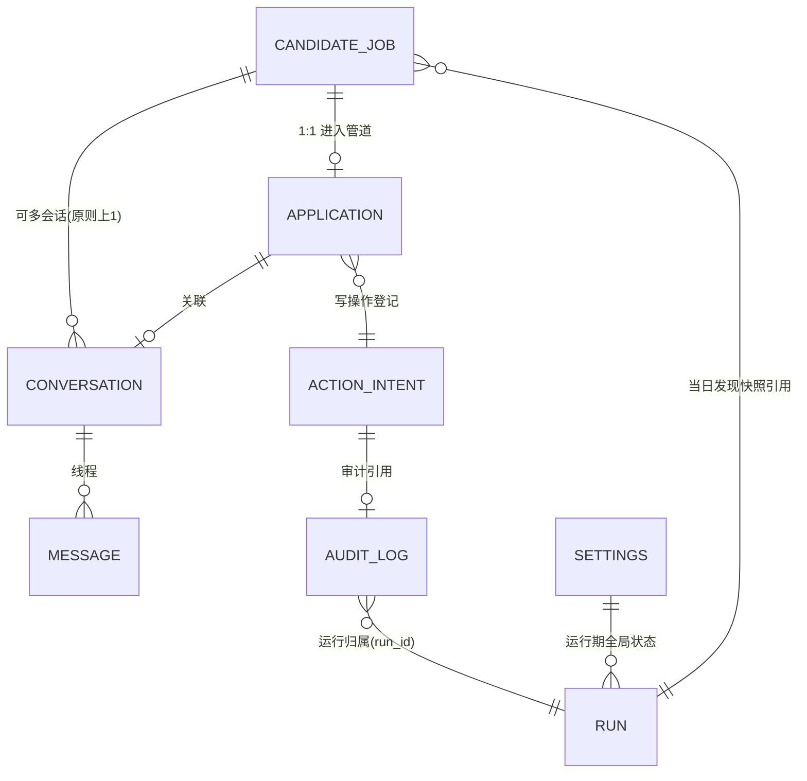

# 自动求职投递 Agent — 数据模型设计（DATA_MODEL.md）

> 状态：规划稿 v0.1，等待确认
> 关联：docs/PRD.md（第七节状态机/字段清单）、docs/ARCHITECTURE.md（§4 数据流、§5 适配器）、docs/TOOL_SPEC.md（工具引用本模型字段）
> 本文件定义：实体、枚举、状态机、约束、幂等键、索引与保留策略。实现（SQLite DDL + Zod 类型）在 IMPLEMENTATION_PLAN.md Phase 1 落地。

---

## 1. 总体约定

- **存储**：单文件 SQLite（`data/job-agent.db`，git 忽略）。SQLite 足够（PRD 第七节结论）；Phase 0 在 `better-sqlite3` 与 `node:sqlite` 间二选一（Node ≥ 22 可选后者；本地 Node 版本决定，见 PLAN P0）。
- **主键**：内部 ID 一律 **ULID**（TEXT，可排序）；平台侧 ID（岗位/消息/会话）原样保留在 `*_external_*` 列。
- **时间**：`*_at` 一律 ISO-8601 UTC 文本（TEXT）；另存 `day_key`（TEXT `YYYY-MM-DD`，**Asia/Shanghai**）作为"限额日/日报日"键。所有日期键经 Clock 端口产生（ARCHITECTURE §4.5），测试可用虚拟时钟。
- **数值**：薪资 `salary_min_k / salary_max_k` 为 INTEGER（单位：千元/月）；`score_*` 为 REAL 0–100。
- **JSON**：SQLite 无原生 JSON 类型，使用 TEXT + 应用层 Zod 校验；字段名带 `_json` 后缀。
- **变更纪律**：业务表允许程序按状态机 UPDATE；`audit_log` **只插入不更新**；`action_intents` 只做 `pending → executed/failed/skipped/duplicate/cancelled` 单向推进（更新列白名单见 §7）。
- **外键**：开启 `PRAGMA foreign_keys=ON`；迁移脚本带版本号，Phase 1 提供 `migrate up/down`（down 仅限开发）。

---

## 2. 实体关系总览



| 表 | 一句话职责 |
|---|---|
| `candidate_jobs` | 平台岗位快照（去重与详情的事实表，可多次"看到"，永不重复投递的依据） |
| `applications` | 每个进入管道的岗位的投递状态机 + 评分/证据/时间线（PRD 第七节字段全覆盖） |
| `conversations` | HR 会话线程：水位线（去重）、冻结状态（needs_human）、关联岗位 |
| `messages` | HR/我方消息逐条记录 + 意图分类结果 |
| `action_intents` | **一切对外写操作的登记账本**（三重门第②③步的核心表） |
| `audit_log` | 全量判断与操作日志（append-only，日审计依据） |
| `runs` | 每次"开工/扫描/日报"运行记录与汇总计数（日报数据源） |
| `settings` | 系统级 kv：全局暂停标记、schema/rubric 版本、水印等 |

---

## 3. 枚举（应用层 Zod + DB CHECK，跨文档统一）

### 3.1 `platform`（PlatformId）
`mock`（唯一默认）｜`boss`（Phase 3+ 用户显式启用）｜可扩展（猎聘/LinkedIn 等，Q 后续）。

### 3.2 岗位管道状态 `application_state`（PRD 第七节状态机，扩展 FAILED）

| 枚举值 | 中文 | 含义 | 终态? |
|---|---|---|---|
| `DISCOVERED` | 已发现 | 刚入库、尚未评分 | 否 |
| `FILTERED` | 已过滤 | 硬条件不满足被排除 | ✅ |
| `QUEUED` | 待沟通 | 匹配通过、等待打招呼（≥75） | 否 |
| `GREETED` | 已打招呼 | 打招呼成功发出 | 否 |
| `RESUME_SENT` | 已发简历 | HR 明确索要后已发送 | 否 |
| `NO_REPLY` | 暂无回复 | 打招呼后超过 N 天无 HR 回复（默认 5 天，Q14） | 否（可被新消息唤醒） |
| `INTERVIEWING` | 面试沟通 | HR/用户进入面试阶段（由用户确认后置位） | 否 |
| `NEEDS_HUMAN` | 待人工处理 | 敏感/复杂话题或异常，会话冻结，等用户 | 否 |
| `FAILED` | 执行失败 | 打招呼/发送重试后仍失败；含失败原因 | ✅（人工可复位） |

允许迁移（代码层状态机校验 + DB CHECK 兜底，`u`=用户手动、`s`=系统/工具）：

```text
DISCOVERED --(s: 硬过滤)--> FILTERED
DISCOVERED --(s: 评分)--> QUEUED | FILTERED | NEEDS_HUMAN(评分为review)
QUEUED  --(s: send_greeting 成功)--> GREETED
QUEUED|GREETED --(s: 失败收敛)--> FAILED
GREETED --(s: HR 明确索要→send_resume 成功)--> RESUME_SENT
GREETED|RESUME_SENT --(s: HR 敏感/复杂)--> NEEDS_HUMAN
RESUME_SENT --(s: 超期无回复)--> NO_REPLY
NO_REPLY --(s: 收到新 HR 消息)--> GREETED 的前一有效状态推进
NEEDS_HUMAN --(u: 处理后)--> INTERVIEWING | NO_REPLY | RESUME_SENT | CLOSED(经 FAILED? 否→直接终态置位)
```

> 简化约定：`NEEDS_HUMAN` 解除后由用户选择去向；`FAILED` 仅人工可复位重试。状态迁移表与"谁允许执行"在 Phase 1 以纯函数实现并全量测试（PROPERTY/表格驱动）。

### 3.3 HR 意图 `hr_intent` 与策略桶 `policy_bucket`

| hr_intent | 中文示例 | 默认策略桶 |
|---|---|---|
| `request_resume` | "发一下简历/可以看看简历吗" | `auto_send_resume` |
| `request_online_submit` | "投递一下在线简历" | `auto_send_resume`（mode=online） |
| `availability_check` | "目前在职吗" | `auto_reply_preset` |
| `start_date_question` | "多久可以到岗" | `auto_reply_preset` |
| `location_confirm` | "接受深圳/杭州吗" | `auto_reply_preset` |
| `greeting_smalltalk` | "你好/在吗" | `auto_reply_preset` |
| `salary_discussion` | 询问当前/期望薪资 | `needs_human` |
| `reason_for_leaving` | 离职原因 | `needs_human` |
| `interview_invitation` | 邀约面试时间 | `needs_human` |
| `relocation_request` | 要求北京/上海/长期驻外 | `needs_human` |
| `sensitive_data_request` | 索要身份证等 | `needs_human` |
| `offer_background_check` | Offer/背调/劳动合同 | `needs_human` |
| `unknown` | 无法判定 | `needs_human`（PRD 六节末行） |

policy_bucket：`auto_send_resume`｜`auto_reply_preset`｜`needs_human`｜`no_action`。白名单来源：`config/messages.yaml`（用户可改，默认与上表一致）。分类方法 `classification_method`：`rule`（关键字规则高置信）| `model`（规则未命中时）| `manual`（用户改判）。

### 3.4 动作类型 `action_type`（action_intents / audit 共用）

`check_login` 不写外部、不入 intent。登记意图仅：
`send_greeting`｜`send_resume`｜`send_template_reply`｜`update_application_status`｜`request_pause`｜`resolve_human_item`｜`generate_daily_report`
> - `update_application_status` 属内部写，为何也走 intent？—— 为了与日志 1:1 及状态迁移可回放，内部写也登记但**不计配额、不要求平台 effectId**。
> - `resolve_human_item`（人工解除冻结/关闭会话）由**用户 CLI/界面触发**，不作为模型工具（TOOL_SPEC 无此工具，ARCHITECTURE §6.5）；登记仅为审计完整。
> - 模型侧暂停工具名为 `request_pause`（TOOL_SPEC #18），落库 `action_type=request_pause`。

### 3.5 actor
`agent`（模型经工具）｜`user`｜`system`（代码规则/定时器）｜`cron`（宿主调度）。

---

## 4. 表结构定义

> 设计层类型定义；Phase 1 生成 DDL 与 Zod schema（未知键一律报错）。可空列用 `?`。

### 4.1 `candidate_jobs` — 岗位快照

| 列 | 类型 | 约束 | 说明 |
|---|---|---|---|
| `id` | TEXT(ULID) | PK | 内部主键 |
| `platform` | TEXT | NOT NULL | §3.1 |
| `external_id` | TEXT | NOT NULL | 平台岗位 ID |
| `url` | TEXT | NOT NULL | 平台 URL |
| `fingerprint` | TEXT | NOT NULL | sha256(归一化 title+company+JD正文)，列表页粗去重 |
| `title` / `company` / `city` | TEXT | NOT NULL | |
| `salary_text` | TEXT | NULL | 原始文案，如 "25-50K" |
| `salary_min_k` / `salary_max_k` | INTEGER | NULL | 解析值（千元） |
| `experience_required` | TEXT | NULL | 如 "3-5年" |
| `education_required` | TEXT | NULL | |
| `tags_json` | TEXT | NULL | 平台标签（外包/规模/融资等） |
| `job_type` | TEXT | NULL | 全职/实习… |
| `description` | TEXT | NOT NULL | JD 原文正文 |
| `hr_name` / `hr_title` | TEXT | NULL | 招聘方 |
| `first_seen_day` / `latest_seen_day` | TEXT(day_key) | NOT NULL | |
| `seen_count` | INTEGER | NOT NULL DEFAULT 1 | 被重复发现的次数（不去重删除，仅计数） |
| `is_active` | INTEGER(0/1) | NOT NULL DEFAULT 1 | 平台侧仍可见（下线则 0） |
| `discovered_at` / `updated_at` | TEXT(ISO) | NOT NULL | |

唯一约束：`UNIQUE(platform, external_id)`；索引：`(platform, fingerprint)`、`(latest_seen_day)`。
写入语义：**发现即 upsert**（同 platform+external_id 已存在 → seen_count+1、latest_seen_day 更新、指纹变化则以旧行为"历史"归档 is_active=0 并新插一行？—— 简化：同一 external_id 指纹变化视为同一岗位内容更新，直接更新 description 等，历史留痕靠 audit_log，见 §8 决策 D1）。

### 4.2 `applications` — 投递状态机（PRD 第七节字段全覆盖）

| 列 | 类型 | 约束 | 说明 |
|---|---|---|---|
| `application_id` | TEXT(ULID) | PK | |
| `platform` / `job_external_id` | TEXT | NOT NULL | 指向 candidate_jobs；`UNIQUE(platform, job_external_id)` → 一岗位一管道记录 |
| `state` | TEXT | NOT NULL | §3.2，CHECK 枚举 |
| `state_updated_at` | TEXT(ISO) | NOT NULL | |
| `conversation_id` | TEXT(ULID) | NULL | 建立会话后回填 |
| `score_total` | REAL | NULL | 0–100 |
| `score_dims_json` | TEXT | NULL | `{direction, ai_core, project, pm, industry, city_mode}` 各 0–100 |
| `rubric_version` | TEXT | NULL | 权重表版本（复算用） |
| `evidence_json` | TEXT | NULL | PRD 第四节格式：`{matched_evidence:[{requirement,resume_evidence,status}], risks:[], decision}` |
| `hard_filter_reason` | TEXT | NULL | 命中排除项（城市/方向/外包…） |
| `decision` | TEXT | NULL | `auto_greet`/`auto_greet_second`/`review`/`reject`/`filtered`（§评分分桶） |
| `greeting_template_id` | TEXT | NULL | 用第几套模板 |
| `greeting_text_snapshot` | TEXT | NULL | 实际发出文本（模板渲染后，审计快照） |
| `greeted_at` | TEXT(ISO) | NULL | 打招呼时间 |
| `greeting_effect_id` | TEXT | NULL | 平台返回 effectId |
| `resume_sent_at` / `resume_mode` | TEXT | NULL | `online`/`attachment` |
| `hr_last_reply_at` | TEXT(ISO) | NULL | 最近 HR 消息时间 |
| `next_action` | TEXT | NULL | 人读的"下一步"（日报用） |
| `failure_reason` | TEXT | NULL | FAILED/异常说明 |
| `needs_human_reason` | TEXT | NULL | 冻结原因 |
| `created_at` / `updated_at` | TEXT(ISO) | NOT NULL | |

索引：`(state, decision)`、`(platform, state)`、`(hr_last_reply_at)`。

### 4.3 `conversations` — 会话线程

| 列 | 类型 | 约束 | 说明 |
|---|---|---|---|
| `conversation_id` | TEXT(ULID) | PK | |
| `platform` | TEXT | NOT NULL | |
| `external_conversation_id` | TEXT | NULL | 平台侧会话 ID（打招呼后可得） |
| `platform` / `job_external_id` | TEXT | NOT NULL | 关联岗位 |
| `hr_name` | TEXT | NULL | |
| `last_seen_platform_message_id` | TEXT | NULL | **消息水位线**（增量拉取去重依据，getNewMessages 用） |
| `state` | TEXT | NOT NULL DEFAULT 'active' | `active`｜`frozen_needs_human`｜`closed` |
| `frozen_reason` | TEXT | NULL | 冻结原因/升级文本 |
| `frozen_at` | TEXT(ISO) | NULL | |
| `created_at` / `updated_at` | TEXT(ISO) | NOT NULL | |

唯一约束：`UNIQUE(platform, external_conversation_id)`（平台会话 ID 为 null 时不约束，可多条 pending）。

### 4.4 `messages` — 消息逐条

| 列 | 类型 | 约束 | 说明 |
|---|---|---|---|
| `message_id` | TEXT(ULID) | PK | |
| `conversation_id` | TEXT(ULID) | NOT NULL FK | |
| `platform_message_id` | TEXT | NULL | 平台消息 ID（我方发出的可能缺失） |
| `direction` | TEXT | NOT NULL | `hr`/`agent` |
| `text` | TEXT | NOT NULL | 正文（不存附件文件，只存提示） |
| `sent_at` | TEXT(ISO) | NOT NULL | |
| `intent` | TEXT | NULL | §3.3 |
| `intent_confidence` | REAL | NULL | 0–1（rule=1，model 给分） |
| `policy_bucket` | TEXT | NULL | §3.3 |
| `classification_method` | TEXT | NULL | rule/model/manual |
| `classification_version` | TEXT | NULL | 规则/模型版本 |
| `processed_at` | TEXT(ISO) | NULL | 何时被裁决 |
| `action_intent_id` | TEXT(ULID) | NULL | 由此消息触发的写操作 |
| `is_hidden` | INTEGER | NULL | 系统内部消息不计入流水 |

唯一约束：`UNIQUE(conversation_id, platform_message_id)`（**HR 消息去重**：同平台消息 ID 只入库一次）；索引 `(conversation_id, sent_at)`。

### 4.5 `action_intents` — 对外写操作登记账本（三重门核心）

| 列 | 类型 | 约束 | 说明 |
|---|---|---|---|
| `intent_id` | TEXT(ULID) | PK | |
| `idem_key` | TEXT | **UNIQUE NOT NULL** | 幂等键（§6）——数据库层兜底"绝不重复执行" |
| `action_type` | TEXT | NOT NULL | §3.4 |
| `run_id` | TEXT(day_key) | NOT NULL | 限额按日核算 |
| `platform` | TEXT | NOT NULL | |
| `target_ref` | TEXT | NOT NULL | 目标：`job:<externalId>` 或 `conv:<id>` |
| `payload_json` | TEXT | NOT NULL | 渲染后全文（发出文本/参数快照）——审计不依赖配置演变 |
| `state` | TEXT | NOT NULL | `pending`→`executed`/`failed`/`skipped`/`duplicate`/`cancelled` |
| `quota_taken` | INTEGER | NOT NULL DEFAULT 0 | 是否占用今日打招呼配额 |
| `effect_id` | TEXT | NULL | 平台返回 effectId |
| `failure_reason` | TEXT | NULL | failed 原因 |
| `attempts` | INTEGER | NOT NULL DEFAULT 0 | ≤2（§A6 收敛） |
| `created_at` / `executed_at` | TEXT(ISO) | NULL | |

约束：同一 `idem_key` 二次插入被拒 ⇒ 上层捕获后返回 `{duplicate:true, original_intent_id}`，**任何路径都不可能产生第二次平台副作用**。该表在 P1 Mock 阶段全量生效。

### 4.6 `audit_log` — 全量审计（append-only）

| 列 | 类型 | 约束 | 说明 |
|---|---|---|---|
| `id` | TEXT(ULID) | PK | ULID 即时间有序 |
| `at` | TEXT(ISO) | NOT NULL | |
| `day_key` | TEXT | NOT NULL | |
| `run_id` | TEXT | NULL | 所属运行 |
| `actor` | TEXT | NOT NULL | agent/user/system/cron |
| `category` | TEXT | NOT NULL | `decision`(评分/意图/分桶)｜`discovery`｜`external_write`｜`internal_write`｜`login_check`｜`pause`｜`resume`｜`error`｜`report`｜`config_load` |
| `event` | TEXT | NOT NULL | 如 `job.scored`、`greeting.sent`、`msg.classified` |
| `entity_type` / `entity_id` | TEXT | NULL | job/application/conversation/message/intent… |
| `before_json` / `after_json` | TEXT | NULL | 状态机迁移前后快照（仅状态相关字段） |
| `payload_json` | TEXT | NULL | 脱敏补充（分数、原因；**不含密钥/原文全文**，原文在对应表） |
| `result` | TEXT | NOT NULL | `ok`/`failed`/`skipped`/`duplicate`/`paused` |
| `error_code` | TEXT | NULL | 错误分类（§ARCH 6.3） |
| `action_intent_id` | TEXT | NULL | 关联写操作 |
| `source` | TEXT | NULL | 触发方上下文（工具名/规则名/定时器名） |

**写规则：只 INSERT，任何 UPDATE/DELETE 在代码层禁用**（仅迁移工具可动表结构）。索引：`(day_key, actor)`、`(entity_type, entity_id)`、`(run_id)`。审计日志默认保留 1 年（Q10）。

### 4.7 `runs` — 运行记录（日报数据源）

| 列 | 类型 | 约束 | 说明 |
|---|---|---|---|
| `run_id` | TEXT | PK | 形如 `run_2026-05-04_morning` / `_scan_14` / `_report` |
| `kind` | TEXT | NOT NULL | `morning`(开工)｜`scan`(周期查消息)｜`report`(日报)｜`manual` |
| `day_key` | TEXT | NOT NULL | |
| `started_at` / `finished_at` | TEXT(ISO) | NOT NULL | |
| `status` | TEXT | NOT NULL | `completed`/`paused`/`failed`/`partial` |
| `summary_json` | TEXT | NULL | 计数：discovered/hard_passed/ge75/greeted/hr_replied/resume_sent/needs_human/failures |
| `report_md_path` / `report_csv_path` | TEXT | NULL | 产出文件 |
| `exceptions_json` | TEXT | NULL | 异常摘要（验证码/登录/页面变化…） |

### 4.8 `settings` — 系统 kv

| 列 | 类型 | 约束 |
|---|---|---|
| `key` | TEXT | PK |
| `value_json` | TEXT | NOT NULL |
| `updated_at` | TEXT(ISO) | NOT NULL |

预置键：`global_pause`（`{active:bool, reason, paused_at, by}`）、`rubric_version`、`schema_version`、`last_login_check`（{ok, at}）、`greeting_quota_used`（按 day_key 计，亦可由 action_intents 聚合，双保险）、`profile_version`。

---

## 5. 关键业务不变式（Invariants，测试必须覆盖）

1. 同一 `(platform, external_id)` 至多一条有效 application 记录；**已进入 `GREETED` 及之后的岗位，任何路径不得再次产生 `send_greeting`**（idem_key 兜底 + 应用层状态检查双保险）。
2. `send_resume` 仅当会话对应 application.state ∈ {GREETED, RESUME_SENT(补发? 否→仅 GREETED, NEEDS_HUMAN 人工放行)} 且消息 intent ∈ auto_send_resume 白名单。
3. 写操作的 audit 记录与 action_intent 一一对应；`action_intents.state=executed` 必有 `effect_id`（拿不到 effectId 视为 failed）。
4. `audit_log` 不可变；`messages` 对同一 platform_message_id 幂等。
5. 全局暂停时不允许产生任何新的 `external_write`（防御：intent 创建层拦截）。
6. 今日打招呼配额 = 已 executed 且 quota_taken=1 的 intent 数（day_key 内），≤ `daily_maximum`（默认 30）。
7. application.state 迁移只走 §3.2 允许边；非法迁移抛业务异常并审计 `error`。

---

## 6. 幂等键规范（三重门②）

公式（与 ARCHITECTURE §4.4 一致）：

```text
{action_type}:{platform}:{target_ref}:{variant}:{day_key}
  variant =
    send_greeting     → template_id
    send_resume       → mode(online|attachment) + sha256(会话内最近一次 request_resume 的 platform_message_id)[:12]
    send_template_reply → template_id
    update_application_status → 目标状态名（幂等上限迁移：同状态重复置位返回 duplicate）
    request_pause  → pause 会话期唯一序号（由 settings 自增）
    generate_daily_report → 无 variant（同日同类型仅一份）
```

> 跨日重试规则：`send_greeting` 因失败未执行 → 同日重试同 key（attempts≤2）；跨日**必须新 day_key**，但应用层状态仍拦截已 GREETED 的岗位（不变量 1）。

---

## 7. 状态推进与更新白名单

| 表 | 允许的程序化更新 | 禁止 |
|---|---|---|
| `candidate_jobs` | upsert 时全字段 | 手改 external_id/fingerprint |
| `applications` | 状态机边 + 对应时间戳/证据/分数 | 越过状态机跳转 |
| `conversations` | 水位线、state(冻结/关闭)、frozen_* | 删除 |
| `messages` | intent 类字段（裁决后回填） | 改写 text |
| `action_intents` | state 单向、attempts+1、effect_id、failure_reason | 修改 payload/idem_key |
| `audit_log` | 无 | 一切更新/删除 |
| `settings` | 按 key 语义 | — |

---

## 8. 示例与保留策略

示例（最小行，测试种子同构）：

```jsonc
// applications 行（示意）
{
  "platform": "mock",
  "job_external_id": "MOCK-00042",
  "state": "GREETED",
  "score_total": 86,
  "decision": "auto_greet",
  "evidence_json": { "matched_evidence": [
      { "requirement": "具备LLM+RAG产品落地经验", "resume_evidence": "主导LLM+RAG智能客服助手上线", "status": "matched" }],
    "risks": ["JD 要求完整 Agent 平台经验，简历主要为 Agent 外呼探索与 POC"], "decision": "auto_greet" },
  "greeting_template_id": "t1", "greeting_text_snapshot": "您好，我有7年产品经验…",
  "greeted_at": "2026-05-04T01:23:45.000Z", "next_action": "等待 HR 回复"
}
```

保留/清理（默认值，Q10 确认）：

| 数据 | 默认保留 | 处理 |
|---|---|---|
| JD 原文（candidate_jobs.description） | 180 天 | 定时清理为占位摘要 + 保留指纹/统计字段 |
| messages.text（HR 真实内容） | 180 天 | 同上 |
| audit_log | 1 年 | 之后归档导出后清理 |
| action_intents.payload_json | 1 年（审计需要） | 同上 |
| reports/ 文件 | 1 年 | 本地文件，按日命名 |
| Cookie/浏览器 profile | 跟随用户手动清理 | 不参与自动保留逻辑 |

---

## 9. 本文件需要确认的取舍

| ID | 问题 | 默认建议 |
|---|---|---|
| Q10 | 保留期（上表）是否可接受 | 接受；180 天/1 年 |
| Q-D1 | 同一 external_id 岗位 JD 变化：原地更新 or 归档旧行 | 原地更新 + audit 留痕（简化） |
| Q-D2 | `FAILED` 状态是否需要人工才能复位 | 是（防自动重试风暴） |
| Q-D3 | 每日限额聚合以 settings 计数为准 or action_intents 聚合为准 | 以 action_intents 聚合为准，settings 仅缓存 |
