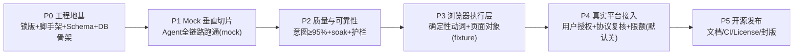

# 自动求职投递 Agent — 实施计划与测试策略（IMPLEMENTATION_PLAN.md）

> 状态：规划稿 v0.1，等待确认；**尚未编写任何业务代码**
> 关联：docs/PRD.md / USER_PROFILE.md / ARCHITECTURE.md / DATA_MODEL.md / TOOL_SPEC.md
> 本文档是工程执行的唯一路线图：阶段拆分、测试策略（Mock 平台与测试数据）、每阶段运行方法与验收证据、以及"仍需你决定的问题"权威清单（附录 A）。

---

## 1. 总原则（约束回放）

1. **第一阶段（P0→P1）只启用 MockPlatformAdapter**，全程不触达 BOSS 直聘。
2. **Agent 决策、代码执行**：模型经 TOOL_SPEC 工具行动；浏览器动作是确定性代码。
3. **写操作三重门**（政策→幂等/限额→审计）在 Mock 阶段完整实现并测试，真实阶段零新增风险。
4. 不做：验证码绕过/反检测/代理池/批量账号（ARCHITECTURE §1.3）。
5. Git 红线：简历、Cookie、账号、API Key、真实 HR 文本不进仓库（ARCHITECTURE §6.6）。
6. 技术栈：TypeScript + DeepSeek Harness（锁版）+ Playwright + SQLite + Zod + Vitest。
7. 本地可运行：P0 起 `npm ci && npm test`；P1 起 `npm run demo:day`（mock）。
8. **DeepSeek Harness 版本锁定**是 P0 交付物，不是口头承诺（见 P0-D3）。
9. 每阶段交付 = 代码 + **运行方法** + **测试结果**（验收证据可复现）。

---

## 2. 开发阶段总览（每个阶段可独立验收）



| 阶段 | 名称 | 依赖 | 关键产出 | 真实平台? | 预计工作量(参考) |
|---|---|---|---|---|---|
| P0 | 工程地基与版本锁定 | — | 锁版、workspace、DB 骨架、配置/Schema、工具壳 | 无 | 3–5 天 |
| P1 | Mock 垂直切片（MVP 主链路） | P0 | MockPlatformAdapter + 状态机 + 三重门 + 评分管道 + 日报 + dsh 工具桥 | **无（Mock）** | 2–3 周 |
| P2 | 质量与可靠性 | P1 | 意图评测≥95%、5 虚拟工作日 soak、暂停恢复、清理、属性测试 | 无 | 1–2 周 |
| P3 | 浏览器执行层 | P1 | browser-runtime 动词 + 本地 fixture 页面 + BossPlatformAdapter(禁运) | 无（本地 fixture 页面） | 1–2 周 |
| P4 | 真实平台接入（可选、默认关） | P3 | 用户授权 checklist、真实登录、dry-run、低限额真跑 | ✅ 需 Q12 确认 | 1 周+用户配合 |
| P5 | 开源发布 | P2(≥) | README/LICENSE/CI/examples/演示 | 无 | 3–5 天 |

> P3 只依赖 P1 是因为浏览器层不与 P2 质量项耦合；顺序可按人力调整，但 P4 之前 **P1 的 Mock 全链路验收必须为绿**（这是把 Mock 作为第一阶段的意义）。

---

## 3. 各阶段详设：交付物 / 运行方法 / 测试结果

> 约定：`run 方法` 里的命令在仓库根执行；`测试结果` 描述**验收证据**——CI 或本地命令跑完后必须能出示的具体产物与数字，不是"看起来没问题"。

### P0 工程地基与版本锁定

**交付物**
- P0-D1 npm workspaces + strict TS + Vitest 骨架；目录结构按 ARCHITECTURE §3.3；`.gitignore` 扩展（reports/、data/、.env、fixtures 中隐私位）。
- P0-D2 Zod 配置 schema：`profile/messages/schedule` 三个 example.yaml 可解析、未知键报错；`docs/USER_PROFILE.md` 内容纳入 profile.example.yaml。
- P0-D3 **版本锁定**：`package.json` 精确锁 `@deepseek-ai/dsh`（当前本机 `0.1.1-rc.2`，与官方 repo 对应 commit 记录于 `docs/PINNED.md`）；CI 首步断言 `dsh --version == PINNED`。
- P0-D4 SQLite 层：选型（`better-sqlite3`/`node:sqlite`，依本地 Node 版本）、迁移器骨架、按 DATA_MODEL §4 建全部表（含 CHECK/唯一约束）。
- P0-D5 类型包：领域枚举/类型/Zod schema 全部就位（DATA_MODEL §3/§4 的可执行版本）。
- P0-D6 **Harness API 核验报告**：用锁定的 Harness 实测 a) 工具注册 b) 定时/唤醒 Agent c) agent preset 挂载，产出 `docs/HARNESS_BINDING.md`，并把结论回写 ARCHITECTURE §3.2/§6.2 与 TOOL_SPEC 头部。**本阶段完成前禁止假设 API 写业务代码。**

**运行方法**
```bash
npm ci
npm exec dsh -- --version     # 必须 == docs/PINNED.md 记录值
npm test                      # 全部单元/迁移测试（含 schema 解析与未知键报错样例）
```

**测试结果（验收证据）**
- CI 徽章 + 本地输出：`dsh --version` 精确匹配；`npm test` 0 failure。
- `docs/PINNED.md` 含版本、commit、核对日期。
- SQLite 空库 `migrate up` 后 `PRAGMA integrity_check=ok`；迁移可重复（up 幂等/版本表）。
- `docs/HARNESS_BINDING.md` 记录三个实测 API 的调用代码片段（取自锁定版本文档/源码）与"可用/需绕过"结论。

**P0 执行决策记录（2026-09-04，用户已"按默认"批准规划）**
| 决策点 | 结论 | 原因 |
|---|---|---|
| 包管理器 | **npm workspaces**（非 pnpm） | 沙箱/本机无法启用 pnpm（corepack EPERM、用户目录不可写），npm 原生等价；布局与文档命令已同步 |
| SQLite 驱动（P0-D4） | **node:sqlite**（Node ≥22.13 免 flag） | 零原生依赖，规避 GitHub 预编译二进制下载风险（沙箱 GitHub 不可达）；Node 22.23.2 实测可用 |
| Harness 锁版 | `@deepseek-ai/dsh@0.1.1-rc.2`（PINNED.md 精确记录 + `verify:pinned` 断言；**二进制安装推迟到有网络条件的机器**，P1 接入时执行 `npm i -D @deepseek-ai/dsh@0.1.1-rc.2`） | 与本机运行实例一致；其依赖树含 60+ scoped 包，本沙箱 registry 延迟下无法安装（实测超时/arborist 中断） |
| 精确依赖 | typescript 5.9.3 / vitest 4.1.11 / zod 4.5.4 / yaml 2.9.0 / @types/node 22.20.1 | registry 现存稳定版；CI 由 `npm run verify:pinned` 强制 |
| P0-D6 Harness API | `docs/HARNESS_BINDING.md` 部分核验（H1–H5 已核验；U1–U5 待联网/人工） | 沙箱 GitHub 不可达；G0 Gate 改为"报告存在+待核验清单显式接受" |
| P0-D3 commit 回填 | `docs/PINNED.md` 待人工核对后回填 | 同上 |

**P0 交付记录（2026-09-04 实测）**

- 交付物：npm workspaces 骨架（根 package.json/.npmrc/tsconfig*、`packages/domain|config-loader|sqlite-store`）、
  `config/*.example.yaml`×3、SQLite 8 表迁移与约束/触发器、`scripts/verify-pinned.mjs`、`docs/PINNED.md`、`docs/HARNESS_BINDING.md`。
- 运行与结果（`npm run ci` = typecheck + verify:pinned + vitest）：
  - `npm run typecheck`：0 error（TS 5.9.3 strict）。
  - `npm test`：3 文件 22 用例全绿（domain 枚举 3 / config-loader Zod strict 12 / sqlite 迁移与约束 7：含 UNIQUE 去重键、CHECK 状态、audit_log append-only 触发器、idem_key 唯一）。
  - `npm run verify:pinned`：OK（依赖全精确；dsh 未安装时给出可选安装提示）。
- 环境适配（本沙箱）：
  - npm 10.9.x arborist 对 vitest@4 optional peer 有 bug ⇒ 仓库 `.npmrc` 固定 `legacy-peer-deps=true`。
  - `@deepseek-ai/dsh` 树过大/registry 慢 ⇒ 不进根 devDependencies，按 PINNED 精确锁定（见决策表）。
- 待办（需要网络/用户机器）：安装 dsh 二进制实测版本断言；核对 repo commit 回填 PINNED；补全 HARNESS_BINDING U1–U5。

---

### P1 Mock 垂直切片（MVP 主链路，**第一阶段唯一业务阶段**）

**范围**（对应 PRD 第一节 12 步中除"真实浏览器/真实登录"外的全部，运行在 Mock 上）
- `platform-mock`：按 ARCHITECTURE §5.3 的 MockPlatformAdapter + 内存模拟器（fixtures 驱动、脚本化 HR、可注入异常、确定种子）。
- `agent-core`：状态机（DATA_MODEL §3.2 纯函数 + 表驱动测试）、candidate 去重、限额、三重门（action_intents + 幂等键 + audit_log）、暂停/恢复、每日编排。
- `job-matcher`：硬过滤 + 证据提取（模型调用，VCR 录制离线跑测试）+ 权重算分 + 分桶；`rubric_version`。
- `conversation-policy`：问候模板渲染（slot 白名单）+ 意图规则库 + 模型分类接口（仅规则未命中）+ 策略桶。
- `daily-reporter`：MD/CSV 日报（数据全来自 DB）。
- `dsh-integration`：注册 TOOL_SPEC 全部 19 个工具的**最小可用版**；`mock` preset 使 Agent 能完成"开工→搜索→评分→打招呼→扫消息→发简历→日报"整循环。
- `tests/e2e-mock/`：场景仿真（见 §5.3）。

**运行方法**
```bash
npm test                        # 全量
npm run demo:day -- --seed 42   # 本地无网演示：1 个虚拟工作日全流程(mock)
npm run dev:harness --workspace @job-agent/dsh-integration   # 若需要起 Harness web/CLI 联调
# 人工验收 Agent 循环：运行 dsh 会话，观察工具调用序列与审计日志
```

**测试结果（验收证据）**
1. **状态机表驱动测试**：全迁移边覆盖 + 非法迁移断言拒绝（0 failure）。
2. **幂等测试**：同 idem_key 二次调用 send_greeting → `DUPLICATE`，平台 mock 侧 effect 计数 = 1（关键断言）。
3. **三重门测试**：quota 满 → `QUOTA_EXHAUSTED`；pause → 全部写工具 `PAUSED`；审计逐条存在且 append-only（尝试 UPDATE 被拒）。
4. **去重测试**：同一 external_id 重复出现在搜索 → 只 1 条 application；`seen_count` 递增。
5. **评分可复算**：VCR 固定证据输入 → 分数与分桶逐位一致。
6. **End-to-end mock 场景**（happy-day / sensitive-day / quota-day / pause-day，§5.3）生成 `reports/YYYY-MM-DD.md|csv` 与黄金审计轨迹 diff 为空。
7. **HR 意图黄金语料**首版跑分（此阶段≥85% 即可，**P2 收紧到 95%**）。
8. dsh 会话演示：Agent 在 mock 平台完成"打招呼→HR 索要简历→自动发送"，人工队列正确出现"询问薪资"。

**P1 交付记录（2026-09-04，离线环境实测）**

- 新增包：`agent-core`（状态机纯函数/Clock/幂等键/ActionGate 三重门/AgentRepo/JobPlatformAdapter 端口）、
  `job-matcher`（硬过滤 + PRD 权重评分 + 分桶 + 证据提取端口）、`conversation-policy`（规则意图分类器 + 策略桶 + 语料）、
  `platform-mock`（MockMarket/MockPlatformAdapter：目录+脚本化 HR+账本+异常注入）、`daily-reporter`（MD/CSV）、
  `dsh-integration`（19 工具清单声明 + fail-closed 注册桩）；fixture 目录 `fixtures/jobs/catalog.json`（14 条，覆盖排除/评分/脚本全类别）。
- 运行与结果（`npm run ci` 全绿）：**10 文件 85 用例 0 failure**。关键断言见 `packages/agent-core/src/e2e/daily-flow.test.ts`：
  虚拟工作日（09:20 起 45min 推进）完成 搜索12→硬过滤3→评分→打招呼→HR 按脚本回复→
  `resume=3`（明确索要）/`preset=1`（在职预设）/`needs_human=2`（薪资、面试邀约）/日报 MD+CSV；
  同时断言：重复打招呼 0（效果数=唯一岗位数）、审计 duplicate=0、intent executed=打招呼数、暂停后所有写操作被拒。
- 与计划的差异（环境所致，均记录）：① 证据提取暂以 fixture 目录证据为确定性输入（模型客户端待 dsh/U1-U5 后接入，接口已定）；② 分类器为规则版（语料 31 条），P2 扩到 ≥200 条并达标 95%；③ 状态机表驱动测试与 NO_REPLY 周期判定在 P2 soak 补齐；④ 四类场景（sensitive/quota/pause）核心语义已并入单场景断言（0 重复/pause/升级），多场景剧本矩阵留 P2。
- **P1H 更新（2026-09-04）**：`@deepseek-ai/dsh@0.1.1-rc.2` 已安装并 CLI 实测可运行（`--help/--version/--dump-default-config`）；HARNESS_BINDING **U1/U2 核验完成**（工具注册 `ctx.tools.register(defineTool(...))` + `schedule_create/at/every` 定时唤醒，均以官方随包 README/类型实证）；最小工具注册 spike 落地并编译+单测绿（`packages/dsh-integration/src/spike.ts`：job_agent_ping，fake-host 注册/释放断言）。剩余 = 配置模型凭据后跑 `dsh headless` LLM 烟测（U3b–U7），随后把 dsh-integration 转 19 工具全量注册、E2E 政策驱动器交给模型调用同一工具面（见 docs/HARNESS_BINDING.md §4）。
- **Q4 已定稿（2026-09-04，G1 达成）**：t1=用户授权文案（无槽）、t2/t3=事实子集变体（slots 白名单：job_title/jd_core_requirement/evidence_project），三者 `approved: true` 轮换；开源示例不含真实姓名（如需带称呼/姓名在本地 messages.yaml 加回）。

---

### P2 质量与可靠性

**P2 进度记录（2026-09-04，全项完成）**
- ① 意图评测框架：`fixtures/hr/intent_corpus.json`（**270 条**唯一语料）→ `intent-eval.test.ts`（混淆矩阵 + `tests/eval/report-latest.json`）；规则覆盖集准确率 **100%（≥95%）**；`npm run test:intent-eval`。
- ② **5 虚拟工作日 soak**：`packages/agent-core/src/e2e/soak.test.ts`——每日新投 4 岗×5 日=20 岗，覆盖 搜索/去重/入队/打招呼(配额)/HR回复/执行器/次日 NO_REPLY(静默岗)/日报×5(MD+CSV)；终局断言 **0 重复**（效果数=唯一岗位数、audit duplicate=0）、**0 状态丢失**（20 行状态合法、无残留 QUEUED/DISCOVERED）、每日限额=4、NO_REPLY 时序正确、审计不可变仍在；`npm run test:soak`。
- ③ **场景矩阵**：`scenario-matrix.test.ts` quota-day（上限 1→第二单拒绝零副作用）/ pause-day（验证码→全局暂停→写操作全拒）/ sensitive-day（薪资+面试邀约→零外发、全部 NEEDS_HUMAN）。
- ④ **确定性兜底**：`services/auto-actions.ts` AutoActionExecutor（规则分类注入、三重门执行；模型可漏、系统不漏）——明确索要→自动发简历仅 1 次（重复被状态机拦截）、薪资→escalate 冻结会话、预设应答文本来自配置。
- ⑤ 保留期清理 `services/retention.ts`（JD/消息 180 天、审计 365 天；审计触发器摘除-删除-重装，append-only 语义恢复）+ 属性测试 `property.test.ts`（500 对随机迁移 canTransition≡assertTransition、FILTERED 无出边/FAILED 仅人工复位→QUEUED、幂等键确定性与灵敏度）。
- 运行与结果：`npm run ci` 全绿 = typecheck + verify:pinned + **16 文件 99 用例 0 failure**。
- ⑥ **真模型接入（路径 A，2026-09-04）**：新增 `packages/model-client`——DeepSeek Chat 结构化 JSON 客户端（`chatJson`+Zod 校验+失败重试）、VCR 录制/回放（`fixtures/vcr/*.json`，离线 CI 可复现）、证据提取器（模型读 JD+画像 → 六维 0–100+证据+风险，程序算分不变）、混合意图判定（规则优先，未命中走模型兜底）。
  实测（真 Key、RUN_MODEL_LIVE=1）：证据提取 1 次调用合规；43 条语料子集**完全一致 40/43**（纯规则未命中 19 条中模型精确命中 16 条；3 条"简单聊两句"被安全归为寒暄——预设应答可接受）；运行 `npm run test:model-live`。真机接入后继续扩疑难集重评。
- ⑦ **A-2 收尾（2026-09-04）**：demo 支持真模型证据（`RUN_MODEL_LIVE=1`，VCR 可离线回放，证据来源计数打印）；新增 `fixtures/hr/hard-corpus.json`（18 条真实疑难 HR 句）真模型评测 **18/18**（规则 7 + 模型兜底 11）；43 条子集稳定 40/43；修正规则顺序（offer 评审优先于薪资）并重录。全量 CI 22 文件/114 用例绿（commit 83407d2）。
- 顺延项（UX/真机相关，不阻塞本阶段验收）：needs_human/review 的 CLI 呈现（Q13）与 DB 按日备份 → P3/P4。

**交付物**
- 意图分类器迭代至 **≥95%**（golden corpus，含"口语/长句/多意图"样本）；分类方法 rule/model 比例统计（成本指标）。
- 5 个**虚拟工作日 soak**：虚拟时钟 + mock，验证"无重复投递、无状态丢失、日报 5 天连续"（PRD §12 验收）。
- 护栏强化：超时/重试策略（Q15）、并发纪律（扫描与打招呼不并发跑）、失败收敛、`apply_pending_auto_actions` 兜底覆盖测试。
- 暂停/恢复 UX：needs_human 队列的 CLI/界面呈现（Q13）；65–74 review 队列每日人工确认流程。
- 数据保留清理任务（Q10）；`audit_log` 不可变属性测试；DB 备份策略（本地按日快照，供用户）。
- 属性/模糊测试：状态机不变量、幂等键不冲突、限额不变量。

**运行方法**
```bash
npm run test:intent-eval        # 输出混淆矩阵 + 准确率(必须≥95%)与失败样例
npm run test:soak -- --days 5 --seed 20260501   # 虚拟5工作日；断言0重复投递/0状态丢失
npm test                        # 全量回归
npm run audit:immutability      # 审计表不可变专项
```

**测试结果（验收证据）**
- intent-eval 报告（`tests/eval/report-latest.json`）：准确率 ≥95%、needs_human 召回 ≥99%（安全优先）、误发率=0 的样本列表。
- soak 输出 `tests/soak/report-5days.json`：每日 counts、`duplicate_sends: 0`、`lost_state_transitions: 0`、幂等键冲突 0。
- 故障注入矩阵全绿（注入登录失效→自动 pause；恢复后无自动重试越界）。

---

### P3 浏览器执行层（不连真实 BOSS，本地 fixture 页面）

**交付物**
- `browser-runtime`：确定性动词集（`goto / list / readDetail / readMessages / clickAndSend(模板文本) / uploadResume`），页面对象校验器 + "页面结构指纹"护栏；**不暴露给模型**（仅供适配器调用）。
- 本地 fixture BOSS 页面服务器（`fixtures/web/boss-*/*.html`，匿名数据）供 Playwright 真驱动。
- `platform-boss`：完整实现 `JobPlatformAdapter`，但**默认禁运**（`PLATFORM=boss` 且未通过 consent 时启动即拒绝，返回明确提示）；对真实 BOSS 零流量。
- 登录态会话：持久化 profile 机制设计 + 用户操作手册（扫码一次，后续复用）；Cookie 仅本机。

**运行方法**
```bash
npm test -- packages/browser-runtime            # Playwright fixture 测试(本地无网)
npm test -- packages/platform-boss              # adapter 语义测试(全部指向本地 fixture 页面)
npm run start -- --platform=boss                # 预期输出: "Boss adapter disabled until consent"（证明禁运生效）
```

**测试结果（验收证据）**
- fixture 页面驱动：搜索/详情/打招呼/读消息/发简历动作在本地 HTML 上通过；页面变化指纹变更时动词返回 `PAGE_CHANGED` 而非乱点。
- adapter 语义测试：与 mock 共用同一套 JobPlatformAdapter 契约测试（同一个测试套件跑两个实现，ARCHITECTURE §5.2 契约被证明可移植）。
- 禁运测试：未授权时任何 boss 调用路径被拒（CI 断言）。

**P3 交付记录（2026-09-04，离线可测部分完成）**
- 新增 `packages/browser-runtime`：确定性动词引擎（goto/search/open_job/read_login_state/greet_send/read_unread_messages/open_chat/resume_send/text_send）+ 页面对象（PageSpec 版本化、角色唯一性/kind 校验）+ `InMemoryDriver`（离线 fixture 驱动，行为确定性可回放）。护栏已验证：当前页缺角色 → `PAGE_CHANGED`、目标岗位不在列表 → `NOT_FOUND`，**不猜测不盲点**（runtime.test.ts）。
- 新增 `packages/platform-boss`：`BossPlatformAdapter` 完整实现接口但 **fail-closed**——未授权（无 enabled + consent 标记）时任何方法抛 `BossDisabledError`（零网络）；`checkConsentFile` 本地标记文件验证（Q12 前置）；每方法需页面角色清单已声明（BOSS_PAGE_ROLE_USAGE）。测试覆盖 未授权全拒 / consent 通过启用 / consent 不匹配拒用。
- fixture 页面占位：`fixtures/web/boss-login.html`、`boss-search.html`（data-testid 角色锚点，匿名）。
- 运行与结果：`npm run ci` 全绿 = **18 文件 105 用例 0 failure**。
- 与计划差异（环境所致，记录如下）：真实 Playwright 浏览器二进制需 CDN 下载（沙箱不可达）⇒ `PlaywrightDriver` 绑定与"本地 HTML 真浏览器驱动"顺延到具备网络的真机（P4 前置步骤：`npm i -D playwright` + `npx playwright install chromium` 后，用同一动词引擎对 fixtures/web 跑 L4）；BOSS 页面选择器与真实 DOM 的校准也只在 P4 用户授权后由用户配合进行。契约可移植性（mock/boss 同一套测试）在 boss 启用并绑定驱动后补全。

**路径 B 记录（2026-09-04，最小闭环）**
- `packages/harness-profile`（纯 JS cordis 插件，inject tools）+ `profiles/job-agent.patch.yml` + `npm run agent:smoke`：headless 会话中模型真实调用自注册工具并回传（B-min-OK）。
- 经验：patch 语法 `- insert:`；inject 声明；parameters 完整 JSON Schema；DSH_HOME hermetic；插件自根 node_modules 解析（详见 HARNESS_BINDING U3b/U7）。
- B2 待办（较大，需先定加载形态）：agent-core TS 业务以可加载产物暴露（新增构建或 node:sqlite 内联 JS 层）→ 19 工具注册 → 模型驱动 E2E（虚拟工作日）→ schedule 定时唤醒。

---
---

### P4 真实平台接入（默认关，需你决策 Q12）

**前置 gate（不满足不开跑）**
1. 你复核 BOSS 现行协议（PRD §现实问题给出的官方入口），确认个人求职助手使用方式可接受，并签署/勾选 consent（本地文件记录）。
2. P1/P2 全绿；P3 禁运解除开关就绪。
3. 你已手动扫码登录且 `check_login` 通过（第一次由你操作，工具不代扫）。
4. 配置 `PLATFORM=boss + DRY_RUN=true` 完成 1 天 dry-run（动作只"登记不发出"，验证意图/顺序正确）。

**交付物/行为**
- 真实运行采用**收缩参数**：每日上限临时 5（而非 30）、仅 hot 分桶（≥80）打招呼、全程可随时 request_pause。
- 真实消息处理与发简历同样受三重门与意图白名单约束；95% 门槛照旧。
- 连续真实运行 1–2 天，输出对比 dry-run 与实际的差异报告。

**运行方法（用户在场）**
```bash
npm run start -- --platform=boss --dry-run    # 第一天：只读演练
npm run start -- --platform=boss --quota=5    # 第二天起：低限额真跑（你可在场随时暂停）
npm run queue:show                            # 查看待人工处理
```

**测试结果（验收证据）**
- dry-run 审计轨迹与 mock 场景结构一致（除平台 ID 外字段映射完整）。
- 低限额真跑日志：0 重复、0 漏发 request_resume、pause 即时生效（人为触发验证）。
- 书面运行小结（日报 + 审计导出），存档本地。

---

### P5 开源发布

**交付物**：README（含快速开始/免责声明/协议提示）、LICENSE（Q3）、CI（P0–P3 全绿 + 锁版断言）、`examples/`（匿名简历样例、sample-report）、`docs/` 校对定稿、可选 demo 录像脚本、tag 发布流程。Docker 支持按 Q8 决定，默认不进 P5。

**运行方法**：`npm run ci`（CI 脚本本地等价）；`npm run demo:day` 给新用户演示。
**测试结果**：干净 clone → README 步骤 → 全绿；无任何真实数据/密钥被检出（`git grep` 红线扫描脚本）。

---

## 4. 测试策略总纲（含 Mock 平台与测试数据设计）

### 4.1 测试金字塔

```text
L6  UAT/人工演练       真实BOSS dry-run→低限额(仅P4, 用户在场)
L5  Soak 虚拟工作日     5日连续模拟：0重复/0丢失(虚拟时钟)
L4  Browser fixture    Playwright 驱动本地HTML页面(无外网)
L3  意图评测            黄金语料 ≥95%，needs_human 召回≥99%
L2  Mock E2E 场景      黄金审计轨迹 diff；三重门/幂等断言
L1  集成(DB/迁移/仓储)  真 SQLite 临时库
L0  单元(纯函数)        状态机/评分/模板渲染/去重/配额
```

- L0–L5 全部离线可跑（模型调用走 **VCR**：录制结构化证据请求→响应，测试回放，无网络无成本）。
- 确定性来源：固定 PRNG 种子 + 虚拟时钟 + VCR ⇒ 同一命令两次运行输出一致（CI 可断言）。

### 4.2 可测性基建（P1 交付）

| 基建 | 说明 |
|---|---|
| `Clock` 端口 | system / virtual（快进工作日、对齐 09:30/17:30/18:00） |
| `Seed` 注入 | 所有 fixture 随机性显式播种 |
| `VcrModelClient` | 模型调用录制/回放（证据提取、疑难分类两处） |
| `ScenarioRunner` | 剧本 = 岗位目录 + HR 脚本 + 异常事件时间表 + 种子 |
| `AuditMatcher` | 断言黄金审计轨迹（事件序列/关键字段 diff） |

### 4.3 MockPlatformAdapter 行为规范（fixtures 驱动）

模拟器按剧本推进，不写死单一路径：

```
MockMarket(seed)
 ├─ JobCatalog:     岗位目录(≈60个, 分布可控)
 ├─ HrEngine:       每个 HR 的响应脚本 + 延迟 + 是否附带简历索求
 ├─ AnomalyBus:     注入 login expiry / captcha / page change / 重复消息
 └─ Ledger:         记录收到的 greet/resume/reply 调用(断言副作用次数)
```

HR 行为脚本类型：`request_resume`（索要简历）、`ask_availability`、`invite_interview`（须升级人工）、`ask_salary`（须升级人工）、`silence`（超时转 NO_REPLY）、`request_online_submit`、`mixed/ambiguous`（走模型分类）。每个剧本可配置"何时回、回几条、是否带平台消息 ID 重复"。

### 4.4 测试数据（全部匿名，可进 Git）

| 数据集 | 位置 | 内容与规模 | 用途 |
|---|---|---|---|
| 岗位目录 | `fixtures/jobs/catalog.yaml` | ~60 岗位：覆盖 深圳/杭州/北京/上海、7 类目标岗位、5 类排除类型(数据标注/AI运营/训练运营/纯PM/驻外/销售)、薪资分布、外包标签、配 HR 脚本 | 搜索/去重/硬过滤/评分 |
| 黄金意图语料 | `fixtures/hr/intent_corpus.csv` | **≥200 条** HR 话语：每意图 10–20 条（规范句/口语/错别字/长句/含薪资数字陷阱句/中英混），标注 expected_intent + expected_bucket | 意图评测(≥95%) |
| E2E 剧本 | `fixtures/scenarios/*.json` | happy-day / sensitive-day / quota-day / pause-day / duplicate-day / anomaly-day（含黄金审计轨迹） | L2 场景 |
| 匿名简历 | `examples/anonymized-resume.pdf` | 模板生成的假名简历（与 USER_PROFILE 画像一致但不含真实信息） | 解析管道演示/测试 |
| BOSS fixture 页面 | `fixtures/web/boss-*/**` | 从公开结构手工构造的静态 HTML（含登录页/列表/详情/会话），**不含真实公司/HR** | L4 浏览器测试 |

> 红线检查（CI 脚本）：fixtures 与 examples 中禁止出现真实手机号/邮箱/公司/人名模式；`git grep` 在 PR 时执行。

### 4.5 验收标准 ↔ 阶段映射（PRD 第十二节）

| PRD 验收标准 | 验证位置 | 通过门 |
|---|---|---|
| 工作日可按时自动启动 | P1 dsh 定时 + P5 | 虚拟时钟断言触发 |
| 每天自动沟通 10–30 岗位 | P1 quota-day 场景 + P2 soak | counts ∈ [10,30] 且不凑数 |
| 同一岗位不重复投递 | P1 幂等测试 | duplicate 计数 0 |
| 同一 HR 不重复同话术 | P1 模板轮换测试 | t1→t2→t3 顺序断言 |
| HR 索要简历自动发送 | P1 happy-day E2E | resume 发送事件=1 |
| 复杂问题不擅自回复 | P1 sensitive-day | 零外发 + needs_human |
| 所有对外消息有日志 | P1 三重门测试 | action_intents=audit 1:1 |
| 验证码/异常立即停止 | P1 pause-day + P3 | PAUSED + 零点击断言 |
| 18:00 完整日报 | P1/P2 soak | 文件生成 + 字段齐全 |
| 连续 5 工作日无重复/无丢失 | P2 soak | soak 报告断言 |
| HR 索要简历意图 ≥95% | P2 意图评测 | 混淆矩阵达标 |

---

## 5. 里程碑 Gate（哪些点必须停、要你签字）

| Gate | 时间点 | 条件 | 说明 |
|---|---|---|---|
| G0 | P0 后 | Harness API 核验报告 + 锁版文件 | 防止在错误 API 假设上写代码 |
| G1 | P1 后 | mock E2E 全绿（含三重门、幂等、审计）+ 你确认问候模板(Q4) | **第一阶段验收**；此后可并行 P2/P3 |
| G2 | P2 后 | 意图≥95%、soak 5 日绿 | 质量门 |
| G3 | P3 后 | fixture 浏览器测试绿 + boss 禁运断言 | 真实平台前的最后防线 |
| G4 | P4 前 | Q12 你明确同意 + 协议复核 + dry-run 完成 | 未过 G4 则项目停在与真实平台零接触状态，仍可完整交付 P0–P3 开源版 |

---

## 6. 风险清单

| 风险 | 缓解 | 关联 |
|---|---|---|
| Harness API 不稳定（developer preview） | 锁版 + P0 核验报告 + 升级=显式流程 | P0 |
| BOSS 平台协议/封禁风险 | 定位个人助手 + Mock 先行 + 限额 + pause + 用户授权 G4 | P4 |
| 模型幻觉（编造证据/能力） | A3/A4：模型只出证据、程序算分；slot 白名单；模板批准制 | P1 |
| 意图误判导致误发简历 | 白名单收紧：仅 request_resume/request_online_submit 触发；95% 评测 + needs_human 高召回 | P2 |
| 重复外发 | 数据库唯一幂等键 + 状态机双重拦截（不依赖模型记忆） | P1 |
| 状态丢失 | SQLite 事务 + soak + 审计可回放 | P2 |
| 隐私泄露到 Git | .gitignore + fixtures 匿名 + CI 红线扫描 | P0/P5 |
| 测试与真实脱节 | 契约测试在 mock 与 boss 两个 adapter 上跑同一套（P3） | P3/P4 |

---

## 附录 A：仍需你决定的问题（唯一权威清单）

> 每项给默认建议。**回复格式建议**：`Q1=接受 / Q1=B，理由…`，可整批"全部按默认"。默认值已按本文件与 PRD 最大兼容选定。

| ID | 问题 | 我的默认建议 | 最迟需定 |
|---|---|---|---|
| Q1 | DeepSeek Harness 消费与锁版方式：npm `@deepseek-ai/dsh` 精确版本（当前 0.1.1-rc.2）vs 官方 Git repo commit 依赖？ | 以 npm 精确版本为主 + `docs/PINNED.md` 记录对应 repo commit 与核验日期（两者都要留痕） | P0 前 |
| Q2 | 模型供应与成本：使用你个人 DeepSeek API Key？主决策与证据提取同型号？月度成本上限？ | 同一 key；默认 `deepseek-chat` 为主、`deepseek-reasoner` 仅疑难 HR 分类；建议月上限（如 ¥30）与按日日志 | P0/P1 |
| Q3 | 开源 License | Apache-2.0（含免责声明）或 MIT；建议 Apache-2.0 便于企业用户阅读边界 | P5 前 |
| Q4 | 3 套问候模板定稿文案 | t1 按 PRD 第五节示例；t2/t3 你确认变体（可 P1 先用占位结构） | G1 前 |
| Q5 | 打招呼是否每日自动（无需每天手动"arming"），在限额与时间窗内直接发？ | 是——配额内自动；超 65–74 一律人工队列；任何时刻可 pause | P1 前 |
| Q6 | 时间窗外（如 21:00）到达的 HR 消息如何处理 | 只读记录，下一个工作扫描窗处理；不自动外发 | P1 前 |
| Q7 | 薪资/公司规模/融资/外包是否设硬过滤 | 默认**不设硬过滤**，仅记录并在日报展示（tag 外包等进风险提示）；如需过滤你给出数值 | G1 前 |
| Q8 | 是否要 Docker | 默认不要（P0–P5 本地 npm 运行）；Docker 放 P5 后 Issue | P5 前 |
| Q9 | 法定节假日是否跳过 | 默认不跳过（仅周末跳过），可后续加中国节假日表 | P1 前 |
| Q10 | 数据保留期：JD/HR 文本 180 天、审计 1 年、报告 1 年 | 接受默认 | P2 前 |
| Q11 | send_resume 默认渠道 | 在线简历优先（你需在 BOSS 账号维护好在线简历）；attachment 仅当你配置目录 | P1 前 |
| Q12 | 是否同意/计划进入真实 BOSS 阶段（P4），接受协议复核与个人责任 | 默认：P0–P3 开源部分无争议先做；P4 在你明确同意后单独开启 | G4 前 |
| Q13 | 暂停与"待人工处理"的呈现载体 | 本地 CLI（`npm queue:show` / `pause`）+ 报告文件；DSH Web 界面若可用则复用；不做邮件/IM | P2 前 |
| Q14 | 扫描周期 / 单会话详情上限 / NO_REPLY 判定天数 / 同公司同角色冷却 | 30 分钟 / 15 条 / 5 天 / 30 天 | P1 前 |
| Q15 | 重试与超时默认值 | 平台调用 30s 超时；写操作至多重试 1 次；验证码/登录失效零重试直接 pause | P1 前 |
| Q16 | PDF 解析库 | TS 侧 pdf-parse（或 pdfjs-dist）优先保持全 TS；如效果不佳再评估 PyMuPDF（引入 Python 边界，需你接受） | P1 前 |
| Q-D1…3 | DATA_MODEL §9 三个设计取舍（JD 原地更新、FAILED 人工复位、限额聚合来源） | 按默认 | P1 前 |

---

## 附录 B：交付节奏与输出物对照

| 本阶段之后应有 | 文件 |
|---|---|
| 本规划本身 | docs/ARCHITECTURE.md、DATA_MODEL.md、TOOL_SPEC.md、IMPLEMENTATION_PLAN.md（本文） |
| 你确认后的定稿 | 全部 Q 批复（附录 A）+ PRD/USER_PROFILE 若有增补 |
| P0 | docs/PINNED.md、docs/HARNESS_BINDING.md |
| P1 | packages/*（mock 切片）、tests/e2e-mock、reports 样例 |
| P2 | tests/eval/report-latest.json、tests/soak/report-5days.json |
| P3 | fixtures/web/boss-*、browser-runtime/platform-boss 测试 |
| P4（可选） | consent 记录、dry-run/低限额运行小结 |
| P5 | README/LICENSE/examples/CI/tag |

---

*等待你确认（含附录 A 决策）后，我将从 P0 开始实施。当前未编写任何业务代码。*
