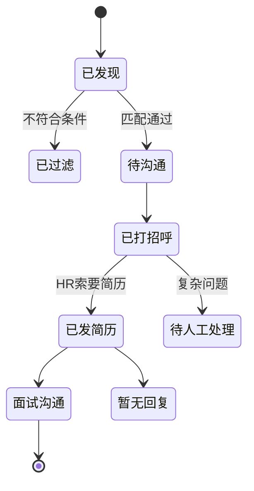
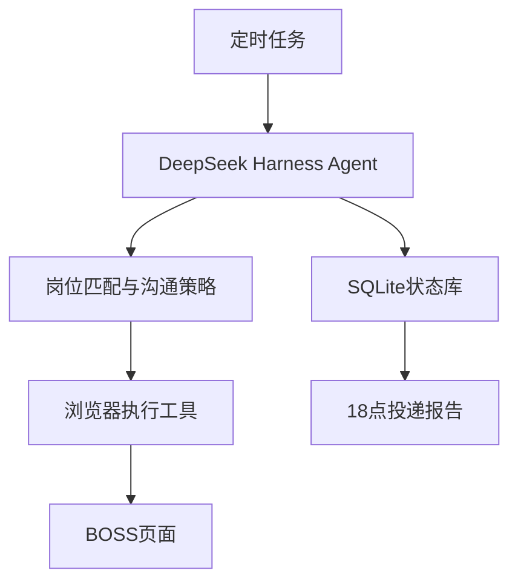

> ⚠️ 公开版说明：本文档是"如何把求职需求做成自动投递 Agent"的产品设计稿。
> 文中出现的**画像数值、城市、项目名称均为示例**（作者真实画像仅在本地 config/candidate.json，不公开）。

对，这个需求应该重新定义为：

> 一个本地运行、定时执行、可审计的“自动求职投递 Agent”：工作日自动搜索岗位、匹配排序、主动打招呼、识别 HR 回复并发送简历，18:00 输出投递日报。

这比单纯岗位匹配更有产品价值，也更能体现 DeepSeek Harness 的 Agent、工具调用、定时任务、状态管理和人机协同能力。

## 一、MVP完整流程

工作日自动执行：

1. 09:30 检查 BOSS 登录状态。
2. 根据城市、岗位关键词、经验、薪资等条件搜索岗位。
3. 抓取当天新岗位并去重。
4. DeepSeek 根据简历和 JD 计算匹配度。
5. 过滤不符合硬条件的岗位。
6. 从高到低选择10～30个岗位。
7. 调用浏览器工具主动打招呼。
8. 定时检查 HR 新消息。
9. 识别“请发简历”等明确意图。
10. 自动发送平台在线简历或附件简历。
11. 更新岗位进度。
12. 18:00生成每日投递报告。

如果当天满足条件的岗位不到10个，就只投符合条件的岗位，不为了凑数量降低标准。

---

## 二、按照你的情况设置默认匹配规则

```yaml
target:
  cities:
    - 深圳
    - 杭州

  job_titles:
    - AI产品经理
    - 大模型产品经理
    - Agent产品经理
    - 对话AI产品经理
    - 智能客服产品经理
    - AI解决方案产品经理
    - 高级产品经理-AI方向

  preferred_skills:
    - LLM
    - Agent
    - RAG
    - Prompt Engineering
    - Conversational AI
    - 智能客服
    - 智能外呼
    - 智能质检
    - Workflow
    - Function Calling

exclude:
  cities:
    - 北京
    - 上海

  job_types:
    - 纯数据标注
    - 纯AI运营
    - 模型训练运营
    - 纯项目经理
    - 长期海外驻场
    - 销售岗位

application:
  minimum_match_score: 75
  daily_minimum: 10
  daily_maximum: 30
  weekdays_only: true
  start_time: "09:30"
  end_time: "17:30"
  report_time: "18:00"
```

薪资、公司规模、融资阶段和是否接受外包公司，可以再由你配置。

---

## 三、MVP功能需求

| 模块 | P0功能 |
|---|---|
| 求职配置 | 城市、关键词、排除词、薪资、经验、每日上限 |
| 简历解析 | 把你的PDF简历转换成结构化候选人画像 |
| 岗位发现 | 搜索岗位、读取列表、进入详情、岗位去重 |
| 岗位匹配 | 硬条件过滤、能力匹配、项目证据匹配 |
| 自动打招呼 | 使用已审核话术，替换岗位和能力字段 |
| 消息监听 | 定时读取HR新消息并识别意图 |
| 简历发送 | HR明确索要简历时自动发送 |
| 进度管理 | 记录已发现、已沟通、已投递、已回复等状态 |
| 定时任务 | 工作日运行、每日限额、18点生成报告 |
| 异常控制 | 登录失效、验证码、页面变化时停止并通知 |
| 操作日志 | 保存Agent每一次判断和外部操作 |

## 四、岗位匹配策略

不能只让模型凭感觉输出一个分数。应该采用：

> DeepSeek负责理解JD和寻找证据，程序负责硬性过滤和计算分数。

| 维度 | 权重 |
|---|---:|
| 岗位方向 | 20 |
| AI核心能力 | 25 |
| 相关项目经验 | 25 |
| 产品经理能力 | 15 |
| 行业经验 | 5 |
| 城市与工作方式 | 10 |

自动投递规则：

- `≥80分`：优先自动打招呼。
- `75～79分`：达到自动投递标准。
- `65～74分`：进入人工确认列表。
- `<65分`：不投递。
- 触发硬性排除条件：直接跳过。

每个结论必须保留证据：

```json
{
  "score": 86,
  "matched_evidence": [
    {
      "requirement": "具备LLM+RAG产品落地经验",
      "resume_evidence": "主导LLM+RAG智能客服助手上线",
      "status": "matched"
    }
  ],
  "risks": [
    "JD要求有完整Agent平台经验，简历主要为Agent外呼探索和POC"
  ],
  "decision": "auto_apply"
}
```

---

## 五、主动打招呼

建议采用“固定模板 + 一个JD个性化字段”，不要让模型完全自由发挥。

默认话术可以是：

> 您好，我有7年产品经验，其中3年专注AI产品，主导过AI语音外呼、LLM+RAG智能客服和智能质检项目，与贵司这个岗位提到的「{{jd核心方向}}」比较匹配，希望进一步沟通，谢谢。

Agent只能替换：

- 招聘方称呼
- 岗位名称
- JD最核心的一项要求
- 对应的一条真实项目经历

禁止生成简历里不存在的能力和指标。

为了避免重复和机械化，可以准备3个经过你确认的话术模板，由系统轮换使用。

---

## 六、HR回复处理

### MVP可以自动处理

| HR消息 | Agent动作 |
|---|---|
| 发一下简历 | 自动发送简历 |
| 可以看看简历吗 | 自动发送简历 |
| 投递一下在线简历 | 点击投递 |
| 目前在职吗 | 根据预设答案回复 |
| 多久可以到岗 | 根据预设答案回复 |
| 接受深圳/杭州吗 | 自动确认 |
| 你好/在吗 | 使用简短预设回复 |

### 必须暂停等待你确认

- 询问当前薪资、期望薪资
- 询问具体离职原因
- 邀约面试时间
- 要求去北京、上海或长期驻外
- 索要身份证等敏感资料
- Offer、背调和劳动合同相关问题
- Agent无法确定对方意图

也就是说，系统可以自动发送简历，但不能擅自替你承诺面试时间、薪资或工作地点。

---

## 七、投递状态机



每个岗位都需要保存：

```text
平台
岗位ID
岗位名称
公司名称
城市
薪资
HR名称
JD原文
匹配分
匹配理由
发现时间
打招呼时间
发送简历时间
最后回复时间
当前状态
下一步动作
失败原因
```

数据库使用 SQLite 就够了。

---

## 八、每日18点报告

日报建议同时生成 Markdown 和 CSV。

### 汇总数据

```text
发现新岗位：68
通过硬条件：31
匹配度≥75：18
主动沟通：18
HR回复：6
已发送简历：4
待人工处理：2
执行失败：1
```

### 岗位明细

| 公司 | 岗位 | 城市 | 匹配度 | 沟通时间 | 当前进度 | HR回复 | 下一步 |
|---|---|---|---:|---|---|---|---|
| A公司 | AI产品经理 | 深圳 | 88 | 10:23 | 已发简历 | 请发简历 | 等待反馈 |
| B公司 | Agent产品经理 | 杭州 | 82 | 14:10 | HR已回复 | 询问薪资 | 等待人工 |
| C公司 | AI项目经理 | 深圳 | 67 | — | 未投递 | — | 匹配不足 |

还应该附上：

- 当天匹配度最高的5个岗位
- 被过滤岗位及原因
- 等待你处理的HR问题
- 登录失败、验证码、页面变化等异常

---

## 九、DeepSeek Harness架构



Harness主要承担：

- 定时唤醒Agent
- 读取简历和求职配置
- 制定当天投递计划
- 调用平台工具
- 判断HR回复意图
- 失败恢复
- 生成日报

DeepSeek Harness允许通过插件注册模型可调用工具，也支持由插件注册定时任务；定时器触发后可以唤醒Agent继续执行任务。[DeepSeek Harness扩展说明](https://github.com/deepseek-ai/deepseek-harness/blob/master/docs/cookbook/extension-cookbook.md)

建议注册这些工具：

```text
search_jobs
get_job_detail
check_duplicate
score_job
send_greeting
list_unread_messages
classify_hr_message
send_resume
send_template_reply
update_application_status
pause_platform
generate_daily_report
```

浏览器操作应该是确定性的代码，Agent只决定“调用哪个工具、传什么参数”，不能让模型直接随意操作网页。

---

## 十、技术方案

```text
DeepSeek Harness：Agent运行与调度
TypeScript：Harness插件
Playwright：本地浏览器操作
SQLite：投递状态和操作日志
Zod：工具参数与结构化结果校验
PDF解析：pdf-parse或PyMuPDF
Cron：工作日任务调度
Markdown/CSV：日报
```

采用本地持久化浏览器：

- 第一次由用户手动扫码登录。
- 后续复用本机登录状态。
- 不把BOSS密码提交给模型。
- Cookie只保存在本地。
- 遇到验证码、登录过期或安全验证立即暂停。
- 不开发验证码绕过、指纹伪装或风控规避。

DeepSeek Harness目前仍属于快速迭代的 developer preview，项目应锁定具体版本或 commit，避免升级导致插件接口失效。[DeepSeek Harness官方仓库](https://github.com/deepseek-ai/deepseek-harness)

---

## 十一、开源项目结构

```text
job-application-agent/
├── README.md
├── LICENSE
├── package.json
├── docker-compose.yml
├── config/
│   ├── profile.example.yaml
│   ├── messages.example.yaml
│   └── schedule.example.yaml
├── packages/
│   ├── agent-core/
│   ├── job-matcher/
│   ├── conversation-policy/
│   ├── browser-runtime/
│   ├── platform-boss/
│   └── daily-reporter/
├── data/
│   └── job-agent.db
├── reports/
├── tests/
│   ├── matching/
│   ├── hr-intent/
│   └── platform/
└── examples/
    ├── anonymized-resume.pdf
    └── sample-report.md
```

核心采用平台适配器：

```ts
interface JobPlatformAdapter {
  checkLogin(): Promise<LoginStatus>;
  searchJobs(query: SearchQuery): Promise<Job[]>;
  getJobDetail(jobId: string): Promise<JobDetail>;
  sendGreeting(jobId: string, message: string): Promise<void>;
  getUnreadMessages(): Promise<Message[]>;
  sendResume(conversationId: string): Promise<void>;
}
```

未来再增加猎聘、LinkedIn等平台时，只需要新增适配器，不改Agent核心。

---

## 十二、MVP验收标准

- 工作日可按时自动启动。
- 每天自动沟通10～30个符合条件的岗位。
- 同一岗位不会重复投递。
- 同一HR不会重复发送相同话术。
- HR明确索要简历时能够自动发送。
- 复杂问题不会擅自回复。
- 所有对外消息和简历发送都有日志。
- 验证码或页面异常时立即停止，不盲目点击。
- 18:00准时生成完整日报。
- 连续运行5个工作日不出现重复投递或状态丢失。
- HR索要简历意图识别准确率达到95%以上。

## 一个必须注意的现实问题

BOSS目前没有面向个人求职者公开的自动投递API。其官方协议页面需要在开发和使用前重新核对；公开可检索的历史协议文本曾明确限制通过未经许可的第三方软件登录、浏览职位和收发简历。因此，这个项目存在账号限制或封禁风险。[BOSS直聘当前平台协议入口](https://about.zhipin.com/agreement?id=registerprotocol)

所以最合理的开源定位是：

> 本地运行、用户自己授权、有限额、全程可暂停的个人求职助手。

项目不提供验证码绕过、批量账号、代理池、反检测等能力。这样仍然能实现你要的自动匹配、打招呼、按要求发送简历和日报，同时保留必要的安全边界。

第一版就做：`BOSS单平台 + 本地运行 + 自动匹配 + 自动打招呼 + 明确索要时发送简历 + 18点日报`。这已经是一个完整、真实可用，而且很适合作为 AI 产品经理求职作品的 MVP。